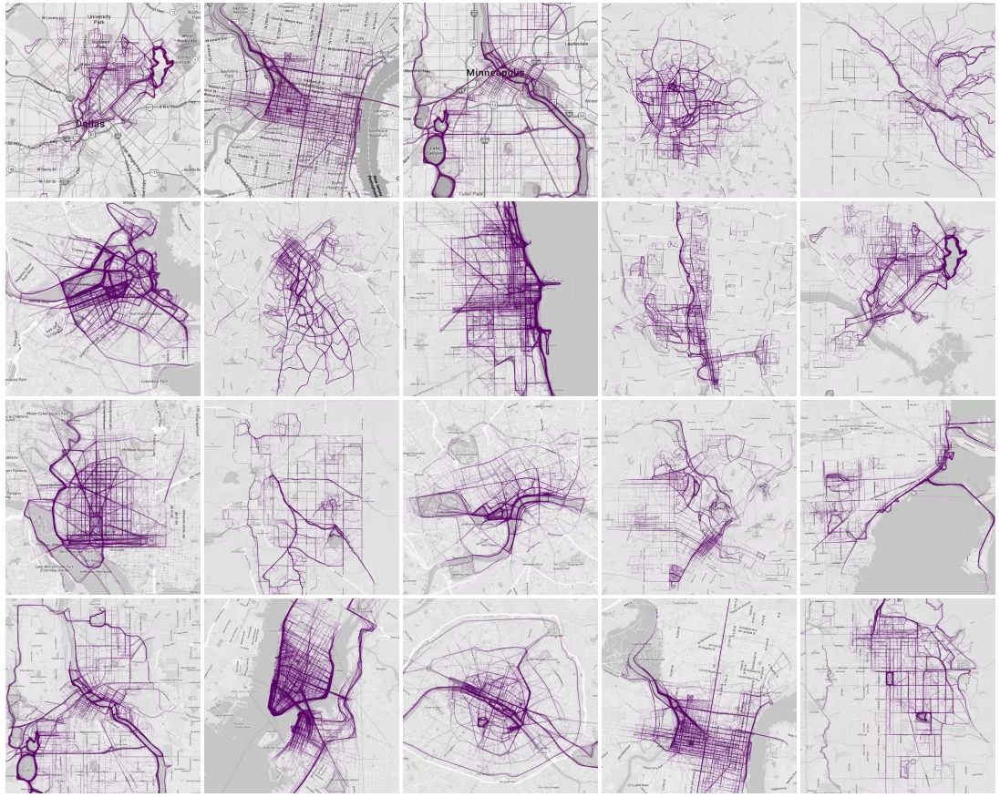
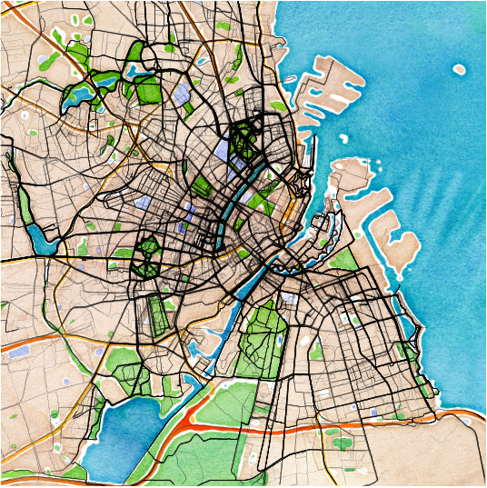

# CityBikeNYC

Visualizing NYC CityBike data.

 
 

### Inspiration drawn from the following blogs:

http://flowingdata.com/2014/02/05/where-people-run/

http://barsukov.net/visualisation/2014/07/25/endomondo/

https://www.visualcinnamon.com/2014/03/running-paths-in-amsterdam-step-2.html

http://toddwschneider.com/posts/a-tale-of-twenty-two-million-citi-bikes-analyzing-the-nyc-bike-share-system/

