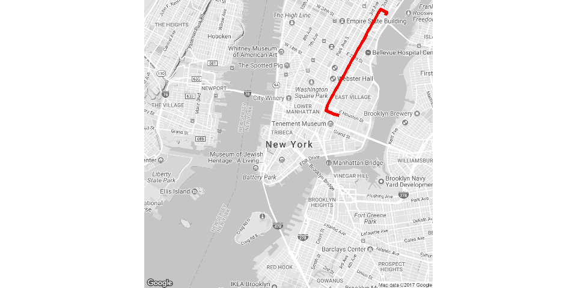

# Build Routes Database
Jesse Lecy  


## Setup


```r
knitr::opts_chunk$set(echo = TRUE, warning=F, message=F, fig.width=10)

library( ggmap )
```

```
## Loading required package: ggplot2
```

```
## Google Maps API Terms of Service: http://developers.google.com/maps/terms.
```

```
## Please cite ggmap if you use it: see citation("ggmap") for details.
```


# Example Route


```r
rt <- route( from=c(-73.96905,40.75002), 
             to=c(-73.99148,40.72229), 
             mode="bicycling",
             structure="route" )

rt
```

<div data-pagedtable="false">
  <script data-pagedtable-source type="application/json">
{"columns":[{"label":["m"],"name":[1],"type":["dbl"],"align":["right"]},{"label":["km"],"name":[2],"type":["dbl"],"align":["right"]},{"label":["miles"],"name":[3],"type":["dbl"],"align":["right"]},{"label":["seconds"],"name":[4],"type":["dbl"],"align":["right"]},{"label":["minutes"],"name":[5],"type":["dbl"],"align":["right"]},{"label":["hours"],"name":[6],"type":["dbl"],"align":["right"]},{"label":["leg"],"name":[7],"type":["int"],"align":["right"]},{"label":["lon"],"name":[8],"type":["dbl"],"align":["right"]},{"label":["lat"],"name":[9],"type":["dbl"],"align":["right"]}],"data":[{"1":"97","2":"0.097","3":"0.0602758","4":"12","5":"0.2000000","6":"0.003333333","7":"1","8":"-73.96898","9":"40.74999"},{"1":"228","2":"0.228","3":"0.1416792","4":"83","5":"1.3833333","6":"0.023055556","7":"2","8":"-73.96842","9":"40.75075"},{"1":"3510","2":"3.510","3":"2.1811140","4":"703","5":"11.7166667","6":"0.195277778","7":"3","8":"-73.97079","9":"40.75174"},{"1":"42","2":"0.042","3":"0.0260988","4":"7","5":"0.1166667","6":"0.001944444","7":"4","8":"-73.99096","9":"40.72412"},{"1":"158","2":"0.158","3":"0.0981812","4":"70","5":"1.1666667","6":"0.019444444","7":"5","8":"-73.99103","9":"40.72375"},{"1":"462","2":"0.462","3":"0.2870868","4":"168","5":"2.8000000","6":"0.046666667","7":"6","8":"-73.99165","9":"40.72241"},{"1":"NA","2":"NA","3":"NA","4":"NA","5":"NA","6":"NA","7":"NA","8":"-73.98655","9":"40.72088"}],"options":{"columns":{"min":{},"max":[10]},"rows":{"min":[10],"max":[10]},"pages":{}}}
  </script>
</div>

```r
# plot the route

nyc <- qmap( "New York City, NY", color='bw', zoom=13 )  

nyc +  geom_path(  aes( x = rt$lon , y = rt$lat ), 
            colour="red", data=rt, alpha=1, size=2 )
```

<!-- -->


# BUILD BIKE STATION DATABASE

In order to create a database of possible routes, we need to create a database with all bike stations.

To build the database let's omit trip info, include only station info, and apply the `unique()` function.


```r
dat <- readRDS(gzcon(url("https://github.com/lecy/CityBikeNYC/raw/master/DATA/bikes.rds")))

keep.these.vars <- c("start.station.id","start.station.name","start.station.latitude","start.station.longitude")

stations <- unique( dat[ keep.these.vars ] )

nrow( stations )
```

```
## [1] 330
```

```r
names( stations ) <- c("ID","StationName","LAT","LON")

stations <- stations[ order( stations$ID ) , ]

rownames( stations ) <- NULL

head( stations )
```

<div data-pagedtable="false">
  <script data-pagedtable-source type="application/json">
{"columns":[{"label":["ID"],"name":[1],"type":["int"],"align":["right"]},{"label":["StationName"],"name":[2],"type":["fctr"],"align":["left"]},{"label":["LAT"],"name":[3],"type":["dbl"],"align":["right"]},{"label":["LON"],"name":[4],"type":["dbl"],"align":["right"]}],"data":[{"1":"72","2":"W 52 St & 11 Ave","3":"40.76727","4":"-73.99393"},{"1":"79","2":"Franklin St & W Broadway","3":"40.71912","4":"-74.00667"},{"1":"82","2":"St James Pl & Pearl St","3":"40.71117","4":"-74.00017"},{"1":"83","2":"Atlantic Ave & Fort Greene Pl","3":"40.68383","4":"-73.97632"},{"1":"116","2":"W 17 St & 8 Ave","3":"40.74178","4":"-74.00150"},{"1":"119","2":"Park Ave & St Edwards St","3":"40.69609","4":"-73.97803"}],"options":{"columns":{"min":{},"max":[10]},"rows":{"min":[10],"max":[10]},"pages":{}}}
  </script>
</div>

```r
saveRDS( stations, "STATIONS.rds")
```


# BUILD A LIST OF ROUTES

The number of possible pairs of unique elements, or in other words the number of routes traveling from one station to another, can be calculated as follows:

* For all pairs including trips that start and end at the same station:  N * N

* If we omit trips that start and stop at the same station: N * (N-1)

* If we assume the route from A to B is the same as from B to A: ( N * (N-1) ) / 2

Since NYC contains a lot of one-way streets, let's not assume that routes are symmetric.

Note that the `route()` function in R returns a data frame object. We can store all possible routes as a list of data frames.


```r
routes <- list()


for( i in 1:5 )
{

   rt <- route( from=c(stations$LON[1], stations$LAT[1]), 
             to=c(stations$LON[i], stations$LAT[i]), 
             mode="bicycling",
             structure="route" )
   
   route.name <- paste( "S.", stations$ID[1], "_to_S.", stations$ID[i], sep="" )
   
   rt <- cbind( rt, from.to=route.name )

   routes[[i]] <- rt

   names(routes)[i] <- route.name

}


routes[ 1:3 ]
```

```
## $S.72_to_S.72
##    m km miles seconds minutes hours leg       lon      lat      from.to
## 1  0  0     0       0       0     0   1 -73.99576 40.76799 S.72_to_S.72
## 2 NA NA    NA      NA      NA    NA  NA -73.99576 40.76799 S.72_to_S.72
## 
## $S.72_to_S.79
##       m    km     miles seconds   minutes       hours leg       lon
## 1   149 0.149 0.0925886      26 0.4333333 0.007222222   1 -73.99576
## 2    36 0.036 0.0223704      60 1.0000000 0.016666667   2 -73.99492
## 3  1144 1.144 0.7108816     206 3.4333333 0.057222222   3 -73.99529
## 4  1501 1.501 0.9327214     257 4.2833333 0.071388889   4 -74.00256
## 5  2734 2.734 1.6989076     475 7.9166667 0.131944444   5 -74.00803
## 6    52 0.052 0.0323128      66 1.1000000 0.018333333   6 -74.01161
## 7   143 0.143 0.0888602      28 0.4666667 0.007777778   7 -74.01111
## 8   522 0.522 0.3243708     117 1.9500000 0.032500000   8 -74.00943
## 9   280 0.280 0.1739920      76 1.2666667 0.021111111   9 -74.01024
## 10    6 0.006 0.0037284      52 0.8666667 0.014444444  10 -74.00694
## 11   23 0.023 0.0142922      19 0.3166667 0.005277778  11 -74.00692
## 12   NA    NA        NA      NA        NA          NA  NA -74.00666
##         lat      from.to
## 1  40.76799 S.72_to_S.79
## 2  40.76917 S.72_to_S.79
## 3  40.76932 S.72_to_S.79
## 4  40.76073 S.72_to_S.79
## 5  40.74847 S.72_to_S.79
## 6  40.72423 S.72_to_S.79
## 7  40.72427 S.72_to_S.79
## 8  40.72410 S.72_to_S.79
## 9  40.71945 S.72_to_S.79
## 10 40.71912 S.72_to_S.79
## 11 40.71917 S.72_to_S.79
## 12 40.71911 S.72_to_S.79
## 
## $S.72_to_S.82
##       m    km     miles seconds     minutes       hours leg       lon
## 1   149 0.149 0.0925886      26  0.43333333 0.007222222   1 -73.99576
## 2    36 0.036 0.0223704      60  1.00000000 0.016666667   2 -73.99492
## 3  1144 1.144 0.7108816     206  3.43333333 0.057222222   3 -73.99529
## 4  1501 1.501 0.9327214     257  4.28333333 0.071388889   4 -74.00256
## 5  3598 3.598 2.2357972     629 10.48333333 0.174722222   5 -74.00803
## 6   646 0.646 0.4014244     211  3.51666667 0.058611111   6 -74.01336
## 7   215 0.215 0.1336010      62  1.03333333 0.017222222   7 -74.00676
## 8    20 0.020 0.0124280      29  0.48333333 0.008055556   8 -74.00481
## 9    29 0.029 0.0180206       5  0.08333333 0.001388889   9 -74.00459
## 10   40 0.040 0.0248560       6  0.10000000 0.001666667  10 -74.00445
## 11   92 0.092 0.0571688      13  0.21666667 0.003611111  11 -74.00425
## 12  109 0.109 0.0677326      26  0.43333333 0.007222222  12 -74.00360
## 13  512 0.512 0.3181568     108  1.80000000 0.030000000  13 -74.00265
## 14   33 0.033 0.0205062       7  0.11666667 0.001944444  14 -73.99979
## 15   63 0.063 0.0391482      12  0.20000000 0.003333333  15 -73.99957
## 16   NA    NA        NA      NA          NA          NA  NA -74.00014
##         lat      from.to
## 1  40.76799 S.72_to_S.82
## 2  40.76917 S.72_to_S.82
## 3  40.76932 S.72_to_S.82
## 4  40.76073 S.72_to_S.82
## 5  40.74847 S.72_to_S.82
## 6  40.71658 S.72_to_S.82
## 7  40.71362 S.72_to_S.82
## 8  40.71249 S.72_to_S.82
## 9  40.71244 S.72_to_S.82
## 10 40.71263 S.72_to_S.82
## 11 40.71296 S.72_to_S.82
## 12 40.71363 S.72_to_S.82
## 13 40.71428 S.72_to_S.82
## 14 40.71073 S.72_to_S.82
## 15 40.71097 S.72_to_S.82
## 16 40.71133 S.72_to_S.82
```


We can then find the specific route we need by referencing endpoints:


```r
route.name
```

```
## [1] "S.72_to_S.116"
```

```r
names( routes )
```

```
## [1] "S.72_to_S.72"  "S.72_to_S.79"  "S.72_to_S.82"  "S.72_to_S.83" 
## [5] "S.72_to_S.116"
```

```r
routes[[ route.name ]]
```

<div data-pagedtable="false">
  <script data-pagedtable-source type="application/json">
{"columns":[{"label":["m"],"name":[1],"type":["dbl"],"align":["right"]},{"label":["km"],"name":[2],"type":["dbl"],"align":["right"]},{"label":["miles"],"name":[3],"type":["dbl"],"align":["right"]},{"label":["seconds"],"name":[4],"type":["dbl"],"align":["right"]},{"label":["minutes"],"name":[5],"type":["dbl"],"align":["right"]},{"label":["hours"],"name":[6],"type":["dbl"],"align":["right"]},{"label":["leg"],"name":[7],"type":["int"],"align":["right"]},{"label":["lon"],"name":[8],"type":["dbl"],"align":["right"]},{"label":["lat"],"name":[9],"type":["dbl"],"align":["right"]},{"label":["from.to"],"name":[10],"type":["fctr"],"align":["left"]}],"data":[{"1":"149","2":"0.149","3":"0.0925886","4":"26","5":"0.4333333","6":"0.007222222","7":"1","8":"-73.99576","9":"40.76799","10":"S.72_to_S.116"},{"1":"36","2":"0.036","3":"0.0223704","4":"60","5":"1.0000000","6":"0.016666667","7":"2","8":"-73.99492","9":"40.76917","10":"S.72_to_S.116"},{"1":"1144","2":"1.144","3":"0.7108816","4":"206","5":"3.4333333","6":"0.057222222","7":"3","8":"-73.99529","9":"40.76932","10":"S.72_to_S.116"},{"1":"1501","2":"1.501","3":"0.9327214","4":"257","5":"4.2833333","6":"0.071388889","7":"4","8":"-74.00256","9":"40.76073","10":"S.72_to_S.116"},{"1":"516","2":"0.516","3":"0.3206424","4":"91","5":"1.5166667","6":"0.025277778","7":"5","8":"-74.00803","9":"40.74847","10":"S.72_to_S.116"},{"1":"27","2":"0.027","3":"0.0167778","4":"6","5":"0.1000000","6":"0.001666667","7":"6","8":"-74.00872","9":"40.74392","10":"S.72_to_S.116"},{"1":"12","2":"0.012","3":"0.0074568","4":"76","5":"1.2666667","6":"0.021111111","7":"7","8":"-74.00841","9":"40.74386","10":"S.72_to_S.116"},{"1":"659","2":"0.659","3":"0.4095026","4":"172","5":"2.8666667","6":"0.047777778","7":"8","8":"-74.00839","9":"40.74396","10":"S.72_to_S.116"},{"1":"75","2":"0.075","3":"0.0466050","4":"45","5":"0.7500000","6":"0.012500000","7":"9","8":"-74.00156","9":"40.74107","10":"S.72_to_S.116"},{"1":"23","2":"0.023","3":"0.0142922","4":"24","5":"0.4000000","6":"0.006666667","7":"10","8":"-74.00113","9":"40.74166","10":"S.72_to_S.116"},{"1":"NA","2":"NA","3":"NA","4":"NA","5":"NA","6":"NA","7":"NA","8":"-74.00137","9":"40.74177","10":"S.72_to_S.116"}],"options":{"columns":{"min":{},"max":[10]},"rows":{"min":[10],"max":[10]},"pages":{}}}
  </script>
</div>


Route names are built using the `paste()` function:


```r
paste( "S.", 72, "_to_S.", 79, sep="" )
```

```
## [1] "S.72_to_S.79"
```

```r
# or more generally

paste( "S.", stations$ID[1], "_to_S.", stations$ID[2], sep="" )
```

```
## [1] "S.72_to_S.79"
```


# FULL LOOP THROUGH ALL ROUTES  

In order to find all possible pairs of stations (330*330=108,900 possible trips), we need to loop through all start points and all end points using a nested loop that will look something like this.


```r
for( i in 1:330 )
{

   for( j in 1:330 )
   {

       from=i, to=j

   }

}
```


If you are creating large lists by querying expensive external APIs, I would recommend breaking the loops into parts and saving each list. This protects from a case where you lose internet connection or hit a query limit and the process stops without recording any progress.


You can save your progress by saving and loading lists as follows:


```r
saveRDS( routes, file="routes.rds " )

readRDS( "routes.rds" )
```


# EXCEEDING GGMAP DAILY LIMITS

The **ggmap** package utilizes the Google Maps API to generate data like geocoding and routes. Google places a 2,500 daily limit on free queries.


```r
ggmap_credentials()
```

```
## Google - 
##    key :  
##    account_type : standard 
##    day_limit : 2500 
##    second_limit : 50 
##    client :  
##    signature :
```

```r
routeQueryCheck()
```


To exceed this limit, you can create a premium account by registering through the developers page on Google and creating a paid account. It costs $0.50 for each 1,000 queries in excess of your free limit. Which means to build a database of 330 x 330 routes it will cost about $55.

https://developers.google.com/maps/web-services/


```r
ggmap_credentials()
```

```
## Google - 
##    key :  
##    account_type : standard 
##    day_limit : 2500 
##    second_limit : 50 
##    client :  
##    signature :
```

```r
API_KEY <- "AbCdEfGhIjKlMnOpQrStUvWxYz"    # fake key for demo

register_google( key=API_KEY, account_type="premium", day_limit=10000 )

ggmap_credentials()
```

```
## Google - 
##    key : AbCdEfGhIjKlMnOpQrStUvWxYz 
##    account_type : premium 
##    day_limit : 10000 
##    second_limit : 50 
##    client :  
##    signature :
```

```r
routeQueryCheck()
```


# BUILD THE DATABASE


```r
for( i in 1:330 )
{
  
  print( paste( "LOOP NUMBER", i ) )
  flush.console()
  
  routes <- list()
  
  for( j in 1:330 )
  {
    
     rt <- try( route( from=c(stations$LON[i], stations$LAT[i]), 
                  to=c(stations$LON[j], stations$LAT[j]), 
                  mode="bicycling",
                  structure="route" 
                 ) )
     
     route.name <- paste( "S.", stations$ID[i], "_to_S.", stations$ID[j], sep="" )
     
     rt <- cbind( rt, from.to=route.name )
  
     routes[[j]] <- rt
  
     names(routes)[j] <- route.name

     print( paste( "I=", i, "J=", j ) )
     flush.console()
     
  }  # end of j loop

  id <- substr( 1000 + i, 2, 4 )
  
  list.name <- paste( "RoutesFromStation", id, ".rda", sep="" )
  
  save( routes, file=list.name )
  
}
```


Once complete, combine all files into a single routes database.


```r
file.names <- dir()

all.routes <- list()

for( i in 1:length(file.names) )
{

  load( file.names[i] )

  all.routes <- c( all.routes, routes )

}


saveRDS( all.routes, file="ALL_ROUTES_LIST.rds" )
```


# Fix Broken Routes

If your internet connection is bad, or if you hit query limits, you will have erroneous routes in your files. These can be fixed by identifying the errors and re-running those specific routes. Of the 108,000 routes I created, I had approximately 3,500 bad routes (error messages) due to bad internet connections.


```r
table( unlist(lapply( all.routes, class )) )

route <- NULL
status <- NULL

for( i in 1:length(all.routes) )
{
    route[i] <- names( all.routes[i] )
    status[i] <- class( all.routes[[i]] )
}

success.log <- data.frame( route, status )

head( success.log )

nrow( success.log )

table( success.log$status )

these <- which( status == "try-error" )


route.names <- route[ these ]

route.names2 <- gsub( "S.", "", route.names )
from.to <- strsplit( route.names2, "_to_" )


for( i in 1:length(these) )
{
  
  print( paste( "ROUTE NAME:", route.names[i] ) )
  flush.console()

  from.id <- from.to[[i]][1]
  to.id <- from.to[[i]][2]

  from.station <- stations[ stations$ID == from.id , ]
  to.station <- stations[ stations$ID == to.id , ]

  rt <- try( route( from=c(from.station$LON, from.station$LAT), 
                  to=c(to.station$LON, to.station$LAT), 
                  mode="bicycling",
                  structure="route" 
                 ) )
     
     route.name <- route.names[i]

     if( names( all.routes[these[i]] ) == route.name )
     {
  
       all.routes[[these[i]]] <- rt

     } else( print("DOES NOT MATCH") )
  

  
}


table( unlist(lapply( all.routes, class )) )


# re-save

saveRDS( all.routes, file="ALL_ROUTES_LIST.rds" )
```


These can be translated into a data frame by:


```r
# add route name to the data frames

for( i in 1:length(all.routes) )
{
    all.routes[[i]] <- cbind( all.routes[[i]], route=names(all.routes[i]) )
}

df <- do.call( rbind.data.frame, all.routes )

head( df )

saveRDS( all.routes, file="ALL_ROUTES_DF.rds" )
```


# Routes Available on GitHub

The routes database (list) and data frame have been posted to GitHub in the DATA repository. The can be loaded by:


```r
rt <- readRDS( gzcon (url( "https://github.com/lecy/CityBikeNYC/raw/master/DATA/ALL_ROUTES_LIST.rds" ) ) )

rt <- readRDS( gzcon (url( "https://github.com/lecy/CityBikeNYC/raw/master/DATA/ALL_ROUTES_DF.rds" ) ) )
```


<style type="text/css">
p {
color: black;
margin: 0 0 20px 0;
}

td {
    padding: 3px 10px 3px 10px;
    text-align: center;
}

table
{ 
    margin-left: auto;
    margin-right: auto;
    margin-top:80px;
    margin-bottom:100px;
}

h1, h2{
  margin-top:100px;
  margin-bottom:20px;
}

H5{
    text-align: center;
    color: gray;
    font-size:0.8em;
}

img {
    max-width: 90%;
    display: block;
    margin-right: auto;
    margin-left: auto;
    margin-top:30px;
    margin-bottom:20px;
}

pre {
  overflow-x: auto;
}

pre code {
   display: block; 
   padding: 0.5em;
   margin-bottom:20px;
}

code {
  font-size: 92%;
  border: 10px solid #F8F8F8;
  margin-bottom: 2px;
}

code[class] {
  background-color: #F8F8F8;
}

</style>

