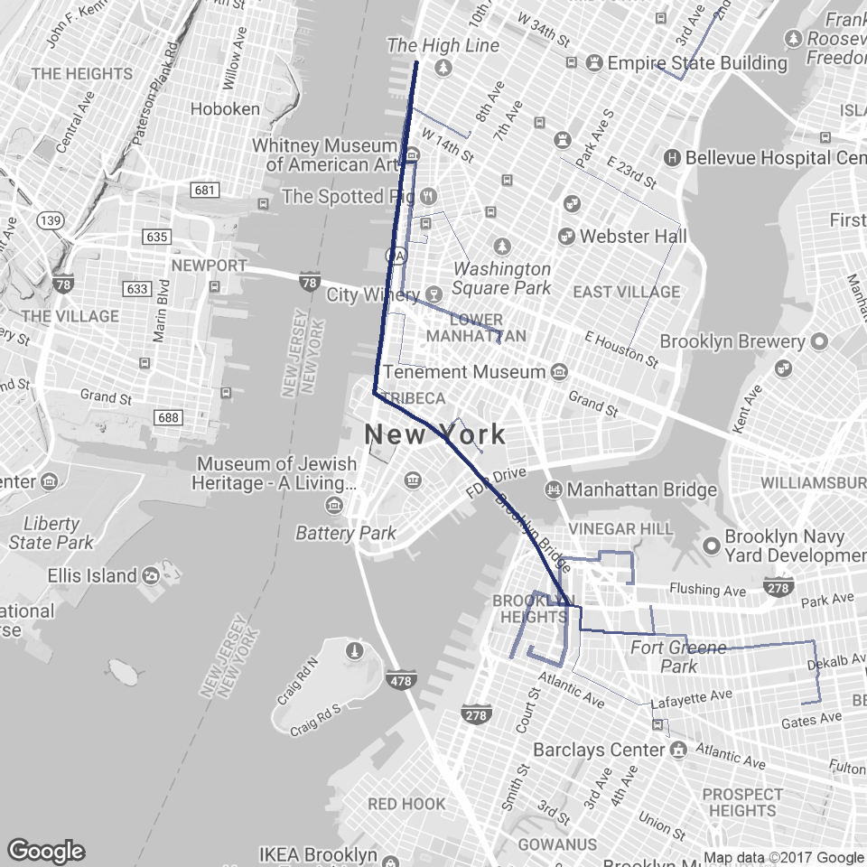

# Mapping Routes
Jesse Lecy  


## Setup


```r
knitr::opts_chunk$set(echo = TRUE, warning=F, message=F, fig.width=10)
```


```r
library( ggmap )
```


# BUILD BIKE STATION DATABASE


```r
dat <- readRDS(gzcon(url("https://github.com/lecy/CityBikeNYC/raw/master/DATA/bikes.rds")))

keep.these.vars <- c("start.station.id","start.station.name","start.station.latitude","start.station.longitude")

stations <- unique( dat[ keep.these.vars ] )

nrow( stations )
```

```
## [1] 330
```

```r
names( stations ) <- c("ID","StationName","LAT","LON")

stations <- stations[ order( stations$ID ) , ]

rownames( stations ) <- NULL

head( stations )
```

<div data-pagedtable="false">
  <script data-pagedtable-source type="application/json">
{"columns":[{"label":["ID"],"name":[1],"type":["int"],"align":["right"]},{"label":["StationName"],"name":[2],"type":["fctr"],"align":["left"]},{"label":["LAT"],"name":[3],"type":["dbl"],"align":["right"]},{"label":["LON"],"name":[4],"type":["dbl"],"align":["right"]}],"data":[{"1":"72","2":"W 52 St & 11 Ave","3":"40.76727","4":"-73.99393"},{"1":"79","2":"Franklin St & W Broadway","3":"40.71912","4":"-74.00667"},{"1":"82","2":"St James Pl & Pearl St","3":"40.71117","4":"-74.00017"},{"1":"83","2":"Atlantic Ave & Fort Greene Pl","3":"40.68383","4":"-73.97632"},{"1":"116","2":"W 17 St & 8 Ave","3":"40.74178","4":"-74.00150"},{"1":"119","2":"Park Ave & St Edwards St","3":"40.69609","4":"-73.97803"}],"options":{"columns":{"min":{},"max":[10]},"rows":{"min":[10],"max":[10]},"pages":{}}}
  </script>
</div>


# Create Four Routes


```r
routes <- list()

for( i in 2:5 )
{

   rt <- route( from=c(stations$LON[1], stations$LAT[1]), 
             to=c(stations$LON[i], stations$LAT[i]), 
             mode="bicycling",
             structure="route" )
   
   route.name <- paste( "S.", stations$ID[1], "_to_S.", stations$ID[i], sep="" )

   rt <- cbind( rt, from.to=route.name )

   routes[[i]] <- rt

   names(routes)[i] <- route.name

}

df <- do.call( rbind.data.frame, routes )


head( df )
```

<div data-pagedtable="false">
  <script data-pagedtable-source type="application/json">
{"columns":[{"label":["m"],"name":[1],"type":["dbl"],"align":["right"]},{"label":["km"],"name":[2],"type":["dbl"],"align":["right"]},{"label":["miles"],"name":[3],"type":["dbl"],"align":["right"]},{"label":["seconds"],"name":[4],"type":["dbl"],"align":["right"]},{"label":["minutes"],"name":[5],"type":["dbl"],"align":["right"]},{"label":["hours"],"name":[6],"type":["dbl"],"align":["right"]},{"label":["leg"],"name":[7],"type":["int"],"align":["right"]},{"label":["lon"],"name":[8],"type":["dbl"],"align":["right"]},{"label":["lat"],"name":[9],"type":["dbl"],"align":["right"]},{"label":["from.to"],"name":[10],"type":["fctr"],"align":["left"]}],"data":[{"1":"149","2":"0.149","3":"0.0925886","4":"26","5":"0.4333333","6":"0.007222222","7":"1","8":"-73.99576","9":"40.76799","10":"S.72_to_S.79"},{"1":"36","2":"0.036","3":"0.0223704","4":"60","5":"1.0000000","6":"0.016666667","7":"2","8":"-73.99492","9":"40.76917","10":"S.72_to_S.79"},{"1":"1144","2":"1.144","3":"0.7108816","4":"206","5":"3.4333333","6":"0.057222222","7":"3","8":"-73.99529","9":"40.76932","10":"S.72_to_S.79"},{"1":"1501","2":"1.501","3":"0.9327214","4":"257","5":"4.2833333","6":"0.071388889","7":"4","8":"-74.00256","9":"40.76073","10":"S.72_to_S.79"},{"1":"2734","2":"2.734","3":"1.6989076","4":"475","5":"7.9166667","6":"0.131944444","7":"5","8":"-74.00803","9":"40.74847","10":"S.72_to_S.79"},{"1":"52","2":"0.052","3":"0.0323128","4":"66","5":"1.1000000","6":"0.018333333","7":"6","8":"-74.01161","9":"40.72423","10":"S.72_to_S.79"}],"options":{"columns":{"min":{},"max":[10]},"rows":{"min":[10],"max":[10]},"pages":{}}}
  </script>
</div>

```r
qmplot( lon, lat, data = df, maptype = "toner-lite",
        colour="red" ) + 
  
        geom_path(  aes( x=lon , y=lat), 
            colour="red", data=df, alpha=1, size=1 ) +
  
        facet_wrap( ~ from.to ) +
  
        theme( legend.position="none", aspect.ratio=8/6 ) 
```

<!-- -->


# Plotting All Routes Together

The challenge here is overlaying many routes on top of each other. 


```r
routes <- list()

for( i in 2:20 )
{

   rt <- route( from=c(stations$LON[1], stations$LAT[1]), 
             to=c(stations$LON[i], stations$LAT[i]), 
             mode="bicycling",
             structure="route" )
   
   route.name <- paste( "S.", stations$ID[1], "_to_S.", stations$ID[i], sep="" )

   rt <- cbind( rt, from.to=route.name )

   routes[[i]] <- rt

   names(routes)[i] <- route.name

}

df <- do.call( rbind.data.frame, routes )

unique.routes <- unique( df$from.to )

route.frequency <- data.frame( route=unique.routes, 
                               trips=sample(1:50, length(unique.routes) ) )

head( route.frequency )
```

<div data-pagedtable="false">
  <script data-pagedtable-source type="application/json">
{"columns":[{"label":["route"],"name":[1],"type":["fctr"],"align":["left"]},{"label":["trips"],"name":[2],"type":["int"],"align":["right"]}],"data":[{"1":"S.72_to_S.79","2":"5"},{"1":"S.72_to_S.82","2":"20"},{"1":"S.72_to_S.83","2":"7"},{"1":"S.72_to_S.116","2":"21"},{"1":"S.72_to_S.119","2":"32"},{"1":"S.72_to_S.120","2":"29"}],"options":{"columns":{"min":{},"max":[10]},"rows":{"min":[10],"max":[10]},"pages":{}}}
  </script>
</div>

```r
df <- merge( df, route.frequency, by.x="from.to", by.y="route" )

nyc <- qmap( "New York City, NY", color='bw', zoom=13 )  

nyc +  geom_path(  aes( x=lon , y=lat, group=from.to ), 
            colour="#1E2B6A", data=df, alpha=0.5, size=df$trips/25 )
```

<!-- -->


<style type="text/css">
p {
color: black;
margin: 0 0 20px 0;
}

td {
    padding: 3px 10px 3px 10px;
    text-align: center;
}

table
{ 
    margin-left: auto;
    margin-right: auto;
    margin-top:80px;
    margin-bottom:100px;
}

h1, h2{
  margin-top:100px;
  margin-bottom:20px;
}

H5{
    text-align: center;
    color: gray;
    font-size:0.8em;
}

img {
    max-width: 90%;
    display: block;
    margin-right: auto;
    margin-left: auto;
    margin-top:30px;
    margin-bottom:20px;
}

pre {
  overflow-x: auto;
}

pre code {
   display: block; 
   padding: 0.5em;
   margin-bottom:20px;
}

code {
  font-size: 92%;
  border: 10px solid #F8F8F8;
  margin-bottom: 2px;
}

code[class] {
  background-color: #F8F8F8;
}

</style>

