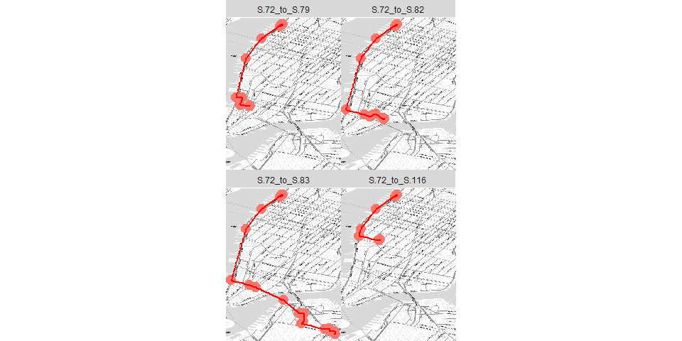
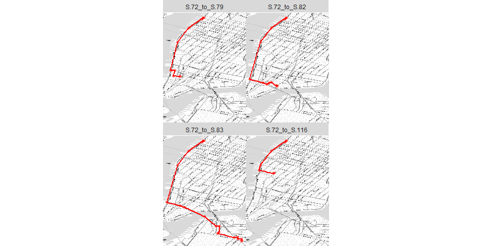

# Mapping Routes
Jesse Lecy  


## Setup


```r
knitr::opts_chunk$set(echo = TRUE, warning=F, message=F, fig.width=10)

library( ggmap )
```

```
## Loading required package: ggplot2
```

```
## Google Maps API Terms of Service: http://developers.google.com/maps/terms.
```

```
## Please cite ggmap if you use it: see citation("ggmap") for details.
```


# BUILD BIKE STATION DATABASE


```r
dat <- readRDS(gzcon(url("https://github.com/lecy/CityBikeNYC/raw/master/DATA/bikes.rds")))

keep.these.vars <- c("start.station.id","start.station.name","start.station.latitude","start.station.longitude")

stations <- unique( dat[ keep.these.vars ] )

nrow( stations )
```

```
## [1] 330
```

```r
names( stations ) <- c("ID","StationName","LAT","LON")

stations <- stations[ order( stations$ID ) , ]

rownames( stations ) <- NULL

head( stations )
```

```
##    ID                   StationName      LAT       LON
## 1  72              W 52 St & 11 Ave 40.76727 -73.99393
## 2  79      Franklin St & W Broadway 40.71912 -74.00667
## 3  82        St James Pl & Pearl St 40.71117 -74.00017
## 4  83 Atlantic Ave & Fort Greene Pl 40.68383 -73.97632
## 5 116               W 17 St & 8 Ave 40.74178 -74.00150
## 6 119      Park Ave & St Edwards St 40.69609 -73.97803
```


# Create Four Routes


```r
routes <- list()

for( i in 2:5 )
{

   rt <- route( from=c(stations$LON[1], stations$LAT[1]), 
             to=c(stations$LON[i], stations$LAT[i]), 
             mode="bicycling",
             structure="route" )
   
   route.name <- paste( "S.", stations$ID[1], "_to_S.", stations$ID[i], sep="" )

   rt <- cbind( rt, from.to=route.name )

   routes[[i]] <- rt

   names(routes)[i] <- route.name

}

df <- do.call( rbind.data.frame, routes )


head( df )
```

```
##                   m    km     miles seconds   minutes       hours leg
## S.72_to_S.79.1  149 0.149 0.0925886      26 0.4333333 0.007222222   1
## S.72_to_S.79.2   36 0.036 0.0223704      60 1.0000000 0.016666667   2
## S.72_to_S.79.3 1144 1.144 0.7108816     206 3.4333333 0.057222222   3
## S.72_to_S.79.4 1501 1.501 0.9327214     257 4.2833333 0.071388889   4
## S.72_to_S.79.5 2734 2.734 1.6989076     475 7.9166667 0.131944444   5
## S.72_to_S.79.6   52 0.052 0.0323128      66 1.1000000 0.018333333   6
##                      lon      lat      from.to
## S.72_to_S.79.1 -73.99576 40.76799 S.72_to_S.79
## S.72_to_S.79.2 -73.99492 40.76917 S.72_to_S.79
## S.72_to_S.79.3 -73.99529 40.76932 S.72_to_S.79
## S.72_to_S.79.4 -74.00256 40.76073 S.72_to_S.79
## S.72_to_S.79.5 -74.00803 40.74847 S.72_to_S.79
## S.72_to_S.79.6 -74.01161 40.72423 S.72_to_S.79
```

```r
qmplot( lon, lat, data = df, maptype = "toner-lite",
        colour="red", size=2 ) + 
  
        geom_path(  aes( x=lon , y=lat), 
            colour="red", data=df, alpha=1, size=1 ) +
  
        facet_wrap( ~ from.to ) +
  
        theme( legend.position="none", aspect.ratio=4/3 )
```

<!-- -->


# Plotting All Routes Together

The challenge here is overlaying many routes on top of each other. 


```r
routes <- list()

for( i in 2:20 )
{

   rt <- route( from=c(stations$LON[1], stations$LAT[1]), 
             to=c(stations$LON[i], stations$LAT[i]), 
             mode="bicycling",
             structure="route" )
   
   route.name <- paste( "S.", stations$ID[1], "_to_S.", stations$ID[i], sep="" )

   rt <- cbind( rt, from.to=route.name )

   routes[[i]] <- rt

   names(routes)[i] <- route.name

}

df <- do.call( rbind.data.frame, routes )

unique.routes <- unique( df$from.to )

route.frequency <- data.frame( route=unique.routes, 
                               trips=sample(1:50, length(unique.routes) ) )

head( route.frequency )
```

```
##           route trips
## 1  S.72_to_S.79    34
## 2  S.72_to_S.82    42
## 3  S.72_to_S.83     7
## 4 S.72_to_S.116     4
## 5 S.72_to_S.119     2
## 6 S.72_to_S.120    31
```

```r
df <- merge( df, route.frequency, by.x="from.to", by.y="route" )

nyc <- qmap( "New York City, NY", color='bw', zoom=13 )  

nyc +  geom_path(  aes( x=lon , y=lat, group=from.to ), 
            colour="#1E2B6A", data=df, alpha=0.5, size=df$trips/25 )
```

<!-- -->

