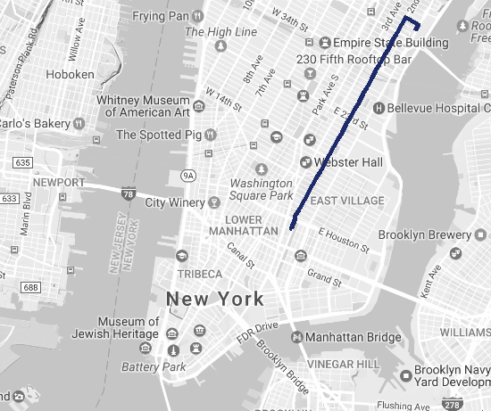

# Routes

The NYC CityBike program consists of 330 separate stations throughout the city. This means that there are ( 330 * 329 ) / 2 possible routes, or 54,285 total routes that someone can choose in the city. This is assuming that the rider selects the same route from Station A to Station B every time.

In order to visualize this information, we need to create a catalogue of all possible routes, and geo-coordinates of those routes. 

We do this using the `route()` function in `ggmap` in R.

The database in this folder contains coordinates and travel time for all possible CityBike routes in NYC.

```r

library( ggmap )

rt <- route( from="40.75002,-73.96905", 
             to="40.72229,-73.99148", 
             mode="bicycling",
             structure="route" )

nyc <- qmap( "New York City, NY", color='bw', zoom=13 )  

nyc +  geom_path(  aes( x = rt$lon , y = rt$lat ), 
            colour="#1E2B6A", data=rt, alpha=1, size=2 )


> rt
     m    km     miles seconds    minutes       hours leg       lon      lat
1   96 0.096 0.0596544      12  0.2000000 0.003333333   1 -73.96898 40.74999
2  228 0.228 0.1416792      83  1.3833333 0.023055556   2 -73.96842 40.75075
3 3510 3.510 2.1811140     703 11.7166667 0.195277778   3 -73.97079 40.75174
4   42 0.042 0.0260988       7  0.1166667 0.001944444   4 -73.99096 40.72412
5  158 0.158 0.0981812      70  1.1666667 0.019444444   5 -73.99103 40.72375
6   15 0.015 0.0093210      23  0.3833333 0.006388889   6 -73.99165 40.72241
7    8 0.008 0.0049712      22  0.3666667 0.006111111   7 -73.99149 40.72237
8   NA    NA        NA      NA         NA          NA  NA -73.99152 40.72230


```




# Large Numbers of Route Queries

**Google credentialing**:  https://github.com/dkahle/ggmap

If you have a Google API key, you can exceed the standard limits Google places on queries. 

https://developers.google.com/maps/web-services/

The cost is currently $0.50 for 1,000 queries for geocoding or routes.

By default, when ggmap is loaded it will set the following credentials and limits:

```r
ggmap_credentials()
#  Google - 
#     key :  
#     account_type : standard 
#     day_limit : 2500 
#     second_limit : 50 
#     client :  
#     signature :

```

Look at the documentation of ?register_google() to learn more. If you do have an API key, you set it with:

```r

register_google(key = "[your key here]", account_type = "premium", day_limit = 100000)
ggmap_credentials()
#  Google - 
#     key : [your key here] 
#     account_type : premium 
#     day_limit : 1e+05 
#     second_limit : 50 
#     client :  
#     signature :

```
