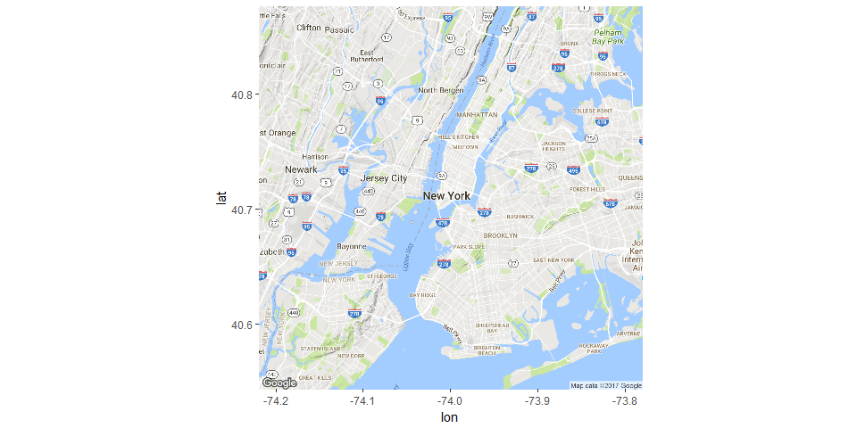

# Mapping CityBike Routes
Oleksiy Anokhin  
July 18, 2017  


## Setup


```r
library( dplyr )
library( ggplot2 )
library( ggmap )
library( leaflet ) 
```


# Steps to Visualize Biking Data Routes

The following steps are explained in this document.

1. Create a list of unique stations.  
2. Create a list of unique pairs of stations. 
3. Create route for each pair of stations. 
4. Create a map of NYC. 
5. Add all routes to the map. 


For this exercise we will use City Bike NYC data from January of 2015. It was obtained from the file posted on AWS, and saved as an RData file.


# Load Data


```r
# Data for Bike Trips

dat <- readRDS(gzcon(url("https://github.com/lecy/CityBikeNYC/raw/master/DATA/bikes.rds")))

str( dat ) # Check the structure - 'data.frame':	285552 obs. of  16 variables
```

```
## 'data.frame':	285552 obs. of  16 variables:
##  $ tripduration           : int  1346 363 346 182 969 496 152 1183 846 576 ...
##  $ starttime              : Factor w/ 36143 levels "1/1/2015 0:01",..: 1 2 3 3 4 5 5 6 7 8 ...
##  $ stoptime               : Factor w/ 36157 levels "1/1/2015 0:07",..: 11 2 4 1 9 5 3 15 10 8 ...
##  $ start.station.id       : int  455 434 491 384 474 512 498 405 450 160 ...
##  $ start.station.name     : Factor w/ 330 levels "1 Ave & E 15 St",..: 4 22 116 169 13 283 50 320 301 126 ...
##  $ start.station.latitude : num  40.8 40.7 40.7 40.7 40.7 ...
##  $ start.station.longitude: num  -74 -74 -74 -74 -74 ...
##  $ end.station.id         : int  265 482 505 399 432 383 474 174 488 174 ...
##  $ end.station.name       : Factor w/ 330 levels "1 Ave & E 15 St",..: 257 268 16 196 153 177 13 117 290 117 ...
##  $ end.station.latitude   : num  40.7 40.7 40.7 40.7 40.7 ...
##  $ end.station.longitude  : num  -74 -74 -74 -74 -74 ...
##  $ bikeid                 : int  18660 16085 20845 19610 20197 20788 19006 17640 15691 17837 ...
##  $ usertype               : Factor w/ 2 levels "Customer","Subscriber": 2 2 2 2 2 2 2 2 2 2 ...
##  $ birth.year             : int  1960 1963 1974 1969 1977 1969 1972 1985 1991 1991 ...
##  $ gender                 : int  2 1 1 1 1 2 1 2 1 1 ...
##  $ ID                     : chr  "455-265" "434-482" "491-505" "384-399" ...
```

```r
names( dat )
```

```
##  [1] "tripduration"            "starttime"              
##  [3] "stoptime"                "start.station.id"       
##  [5] "start.station.name"      "start.station.latitude" 
##  [7] "start.station.longitude" "end.station.id"         
##  [9] "end.station.name"        "end.station.latitude"   
## [11] "end.station.longitude"   "bikeid"                 
## [13] "usertype"                "birth.year"             
## [15] "gender"                  "ID"
```

```r
# Data on Routes
```


# Step 1. Create a list of unique stations


```r
# Pick start station attributes

keep.these.vars <- c("start.station.id","start.station.name",
                     "start.station.latitude","start.station.longitude")

stations <- unique( dat[ keep.these.vars ])

nrow(stations) # 330 unique stations
```

```
## [1] 330
```

```r
names(stations) <- c("ID", "StationName", "LAT", "LON") # Rename column titles

stations <- stations[order(stations$ID),] # put station in ID order from 72 till 3002

rownames(stations) <- NULL

head(stations)
```

<div data-pagedtable="false">
  <script data-pagedtable-source type="application/json">
{"columns":[{"label":["ID"],"name":[1],"type":["int"],"align":["right"]},{"label":["StationName"],"name":[2],"type":["fctr"],"align":["left"]},{"label":["LAT"],"name":[3],"type":["dbl"],"align":["right"]},{"label":["LON"],"name":[4],"type":["dbl"],"align":["right"]}],"data":[{"1":"72","2":"W 52 St & 11 Ave","3":"40.76727","4":"-73.99393"},{"1":"79","2":"Franklin St & W Broadway","3":"40.71912","4":"-74.00667"},{"1":"82","2":"St James Pl & Pearl St","3":"40.71117","4":"-74.00017"},{"1":"83","2":"Atlantic Ave & Fort Greene Pl","3":"40.68383","4":"-73.97632"},{"1":"116","2":"W 17 St & 8 Ave","3":"40.74178","4":"-74.00150"},{"1":"119","2":"Park Ave & St Edwards St","3":"40.69609","4":"-73.97803"}],"options":{"columns":{"min":{},"max":[10]},"rows":{"min":[10],"max":[10]},"pages":{}}}
  </script>
</div>

```r
# The same with dplyr

# Select four columns from "dat" dataframe. 
test1 <- dat %>% 
  select( start.station.id, 
          start.station.name,
          start.station.latitude,
          start.station.longitude  )

# Identify unique stations 
# test2 <- dat %>% select( start.station.id,
#                          start.station.name,
#                          start.station.latitude, 
#                          start.station.longitude) %>% distinct
                        
test2 <- test1  %>% distinct                      


head( test2 )
```

<div data-pagedtable="false">
  <script data-pagedtable-source type="application/json">
{"columns":[{"label":["start.station.id"],"name":[1],"type":["int"],"align":["right"]},{"label":["start.station.name"],"name":[2],"type":["fctr"],"align":["left"]},{"label":["start.station.latitude"],"name":[3],"type":["dbl"],"align":["right"]},{"label":["start.station.longitude"],"name":[4],"type":["dbl"],"align":["right"]}],"data":[{"1":"455","2":"1 Ave & E 44 St","3":"40.75002","4":"-73.96905"},{"1":"434","2":"9 Ave & W 18 St","3":"40.74317","4":"-74.00366"},{"1":"491","2":"E 24 St & Park Ave S","3":"40.74096","4":"-73.98602"},{"1":"384","2":"Fulton St & Waverly Ave","3":"40.68318","4":"-73.96596"},{"1":"474","2":"5 Ave & E 29 St","3":"40.74517","4":"-73.98683"},{"1":"512","2":"W 29 St & 9 Ave","3":"40.75007","4":"-73.99839"}],"options":{"columns":{"min":{},"max":[10]},"rows":{"min":[10],"max":[10]},"pages":{}}}
  </script>
</div>

```r
nrow( test2 )
```

```
## [1] 330
```


We have 330 unique stations in the city:


```r
# plot unique stations and their IDs on a map
```


# Step 2. Identify unique pairs of stations.

Index of all combinations


```r
# combinations of stations

x <- c("A","B","C")
t(combn(x, 2))
```

```
##      [,1] [,2]
## [1,] "A"  "B" 
## [2,] "A"  "C" 
## [3,] "B"  "C"
```


```r
# In a loop, something like this:

for( i in c("A","B","C") )
{
  
  for( j in c("A","B","C") )
  {
    
    paste( i, j, sep="-" )
    
  }
  
}
```


# Step 3. Create route for each pair of stations.

Routes are queried through the Google Maps API.


```r
for(i in 1:330)
{
  print(paste("LOOP NUMBER", i))
  flush.console()
  routes <- list()
  for(j in 1:330)
  {
    rt <- try(route(from=c(stations$LON[i], stations$LAT[i]), 
                      to=c(stations$LON[j], stations$LAT[j]), 
                      mode="bicycling",
                      structure="route" 
    ))
    route.name <- paste("S.", stations$ID[i], "_to_S.", stations$ID[j], sep="")
    rt <- cbind(rt, from.to=route.name)
    routes[[j]] <- rt
    names(routes)[j] <- route.name
    print(paste("I=", i, "J=", j))
    flush.console()
  }  # end of j loop
  
  id <- substr(1000 + i, 2, 4)
  list.name <- paste("RoutesFromStation", id, ".rda", sep="")
  save(routes, file=list.name)
}
```


# Step 4. Load a Map of NYC.


```r
# lots of ways to do this:

# qmap 
nyc <- qmap("New York City, NY", color='bw', zoom=13) 

# ggmpap
nyc_map <- get_map(location = c(lon = -74.00, lat = 40.71), maptype = "terrain", zoom = 11)
ggmap(nyc_map)
```

<!-- -->

### Leaflet


```r
# Leaflet 1
leaflet( dat ) %>% addTiles() %>% setView(-74.0059, 40.7128, zoom = 13)
```

<!--html_preserve--><div id="htmlwidget-e7e55c50407533d27190" style="width:960px;height:480px;" class="leaflet html-widget"></div>
<script type="application/json" data-for="htmlwidget-e7e55c50407533d27190">{"x":{"options":{"crs":{"crsClass":"L.CRS.EPSG3857","code":null,"proj4def":null,"projectedBounds":null,"options":{}}},"calls":[{"method":"addTiles","args":["//{s}.tile.openstreetmap.org/{z}/{x}/{y}.png",null,null,{"minZoom":0,"maxZoom":18,"maxNativeZoom":null,"tileSize":256,"subdomains":"abc","errorTileUrl":"","tms":false,"continuousWorld":false,"noWrap":false,"zoomOffset":0,"zoomReverse":false,"opacity":1,"zIndex":null,"unloadInvisibleTiles":null,"updateWhenIdle":null,"detectRetina":false,"reuseTiles":false,"attribution":"&copy; <a href=\"http://openstreetmap.org\">OpenStreetMap<\/a> contributors, <a href=\"http://creativecommons.org/licenses/by-sa/2.0/\">CC-BY-SA<\/a>"}]}],"setView":[[40.7128,-74.0059],13,[]]},"evals":[],"jsHooks":[]}</script><!--/html_preserve-->

```r
# addTiles("http://korona.geog.uni-heidelberg.de/tiles/roadsg/x={x}&y={y}&z={z}", 
#                                           attribution='Map tiles by <a href="http://stamen.com">Stamen Design</a>, <a href="http://creativecommons.org/licenses/by/3.0">CC BY 3.0</a> &mdash; Map data &copy; <a href="http://www.openstreetmap.org/copyright">OpenStreetMap</a>') 
```


```r
# Leaflet 2
leaflet() %>%
  addTiles() %>%
  setView(-74.00, 40.71, zoom = 12) %>%
  addProviderTiles("CartoDB.Positron")
```

<!--html_preserve--><div id="htmlwidget-049bbba6560ec0fbc6e0" style="width:960px;height:480px;" class="leaflet html-widget"></div>
<script type="application/json" data-for="htmlwidget-049bbba6560ec0fbc6e0">{"x":{"options":{"crs":{"crsClass":"L.CRS.EPSG3857","code":null,"proj4def":null,"projectedBounds":null,"options":{}}},"calls":[{"method":"addTiles","args":["//{s}.tile.openstreetmap.org/{z}/{x}/{y}.png",null,null,{"minZoom":0,"maxZoom":18,"maxNativeZoom":null,"tileSize":256,"subdomains":"abc","errorTileUrl":"","tms":false,"continuousWorld":false,"noWrap":false,"zoomOffset":0,"zoomReverse":false,"opacity":1,"zIndex":null,"unloadInvisibleTiles":null,"updateWhenIdle":null,"detectRetina":false,"reuseTiles":false,"attribution":"&copy; <a href=\"http://openstreetmap.org\">OpenStreetMap<\/a> contributors, <a href=\"http://creativecommons.org/licenses/by-sa/2.0/\">CC-BY-SA<\/a>"}]},{"method":"addProviderTiles","args":["CartoDB.Positron",null,null,{"errorTileUrl":"","noWrap":false,"zIndex":null,"unloadInvisibleTiles":null,"updateWhenIdle":null,"detectRetina":false,"reuseTiles":false}]}],"setView":[[40.71,-74],12,[]]},"evals":[],"jsHooks":[]}</script><!--/html_preserve-->


# Step 5. Add all routes to the map.

lots of ways to do this
and we will need to play with aesthetics

we can add multiple routes by grouping them,
or we can layer them using a loop


```r
df <- do.call(rbind.data.frame, routes)

### create some fake trip data

unique.routes <- unique(df$from.to) # pick all unique routes 

route.frequency <- data.frame( route=unique.routes, 
                               trips=sample(1:50, length(unique.routes)))

head(route.frequency) 

df <- merge(df, route.frequency, by.x="from.to", by.y="route") # merge data

# Mapping data

nyc <- qmap("New York City, NY", color='bw', zoom=13)  

nyc + geom_path( aes( x=lon , y=lat, group=from.to), 
                   colour="#1E2B6A", data=df, alpha=0.5, size=df$trips/25)
```


<style type="text/css">
p {
color: black;
margin: 0 0 20px 0;
}

td {
    padding: 3px 10px 3px 10px;
    text-align: center;
}

table
{ 
    margin-left: auto;
    margin-right: auto;
    margin-top:80px;
    margin-bottom:100px;
}

h1, h2{
  margin-top:100px;
  margin-bottom:20px;
}

H5{
    text-align: center;
    color: gray;
    font-size:0.8em;
}

img {
    max-width: 90%;
    display: block;
    margin-right: auto;
    margin-left: auto;
    margin-top:30px;
    margin-bottom:20px;
}

pre {
  overflow-x: auto;
}

pre code {
   display: block; 
   padding: 0.5em;
   margin-bottom:20px;
}

code {
  font-size: 92%;
  border: 10px solid #F8F8F8;
  margin-bottom: 2px;
}

code[class] {
  background-color: #F8F8F8;
}

</style>


