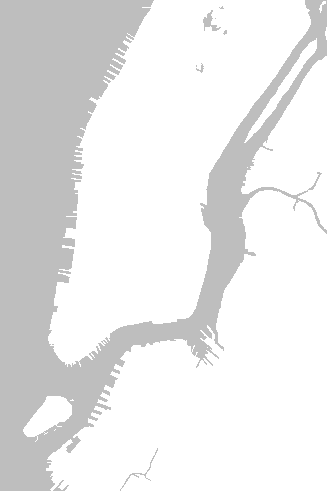
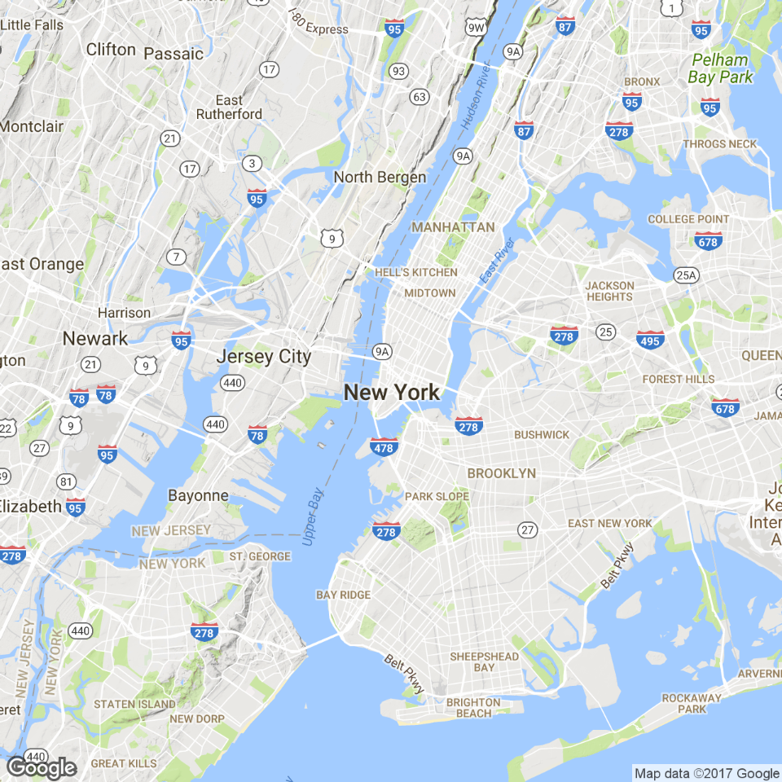
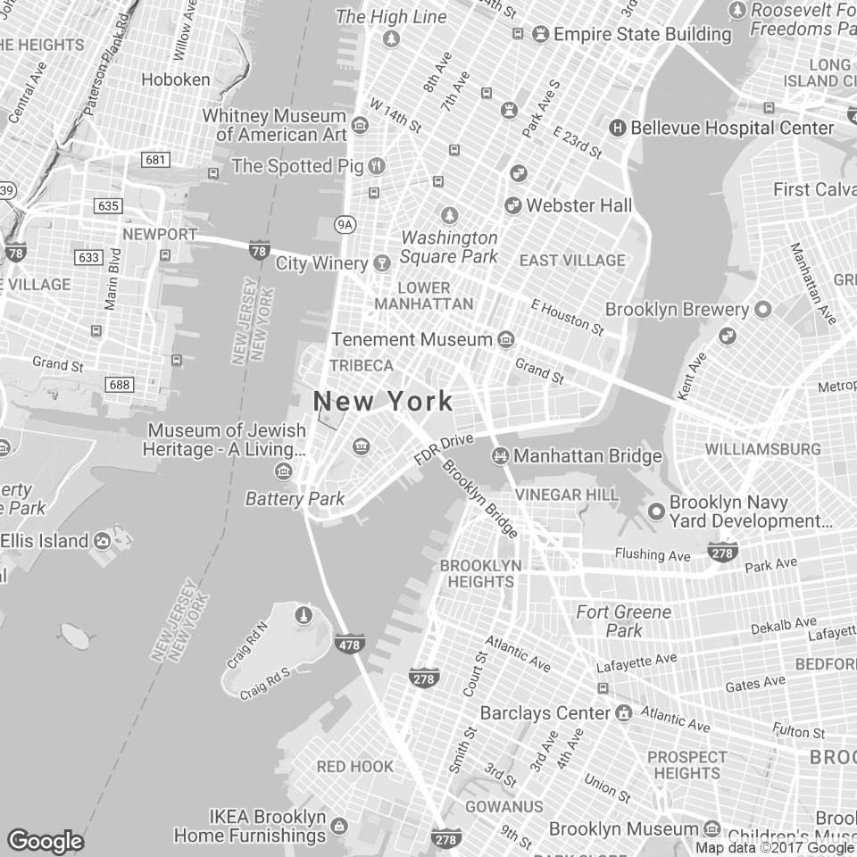
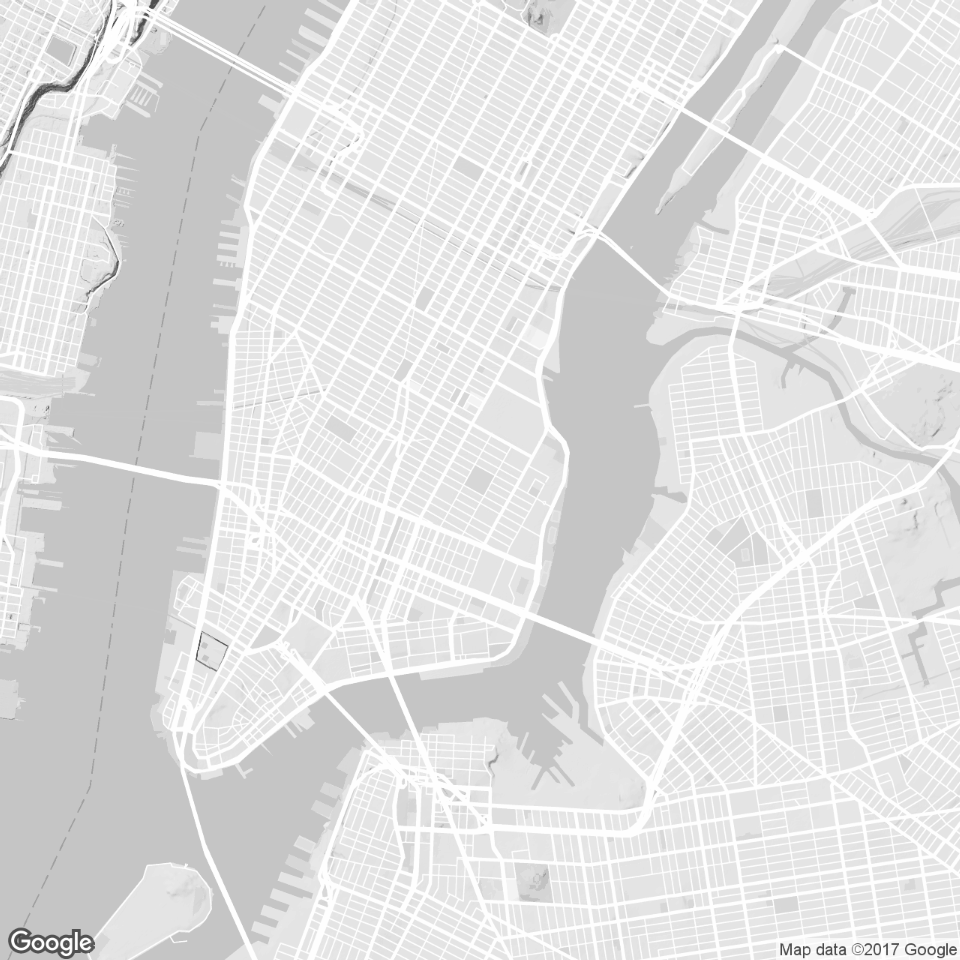
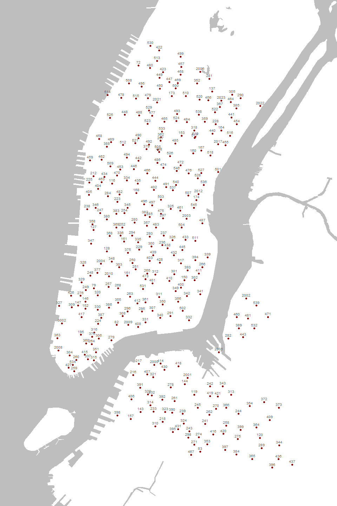
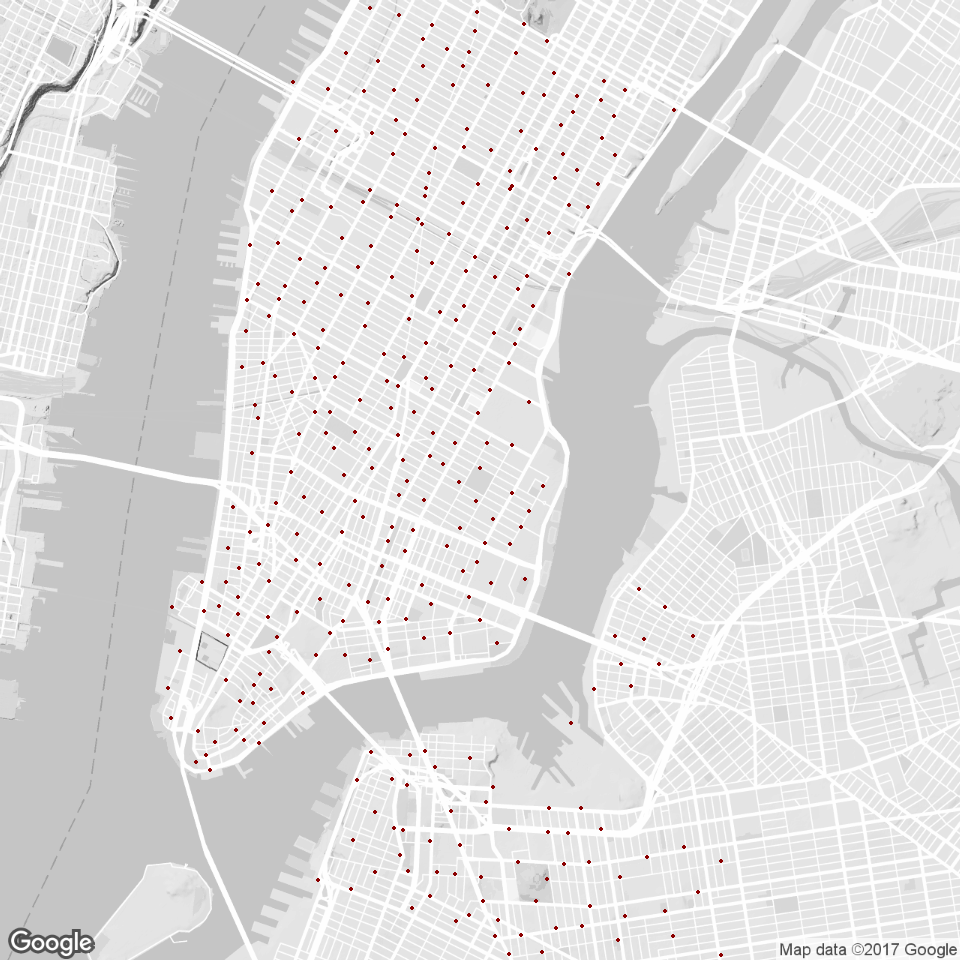
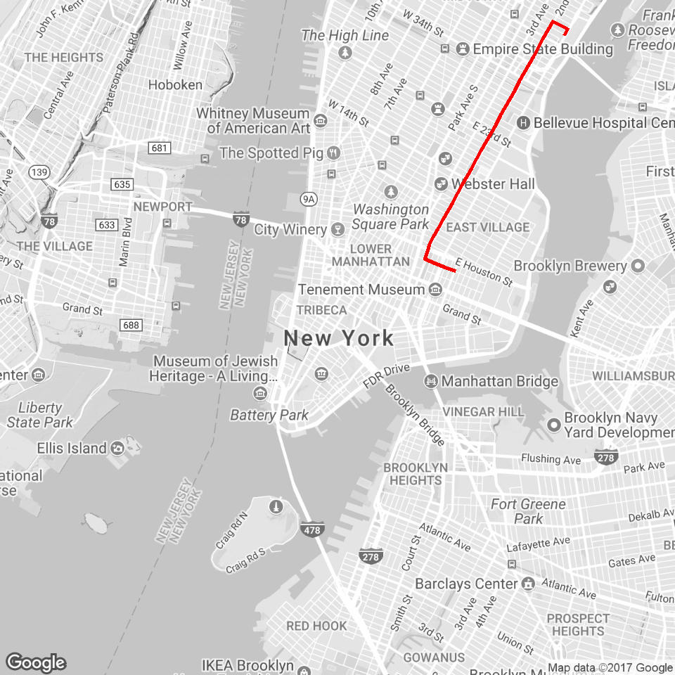
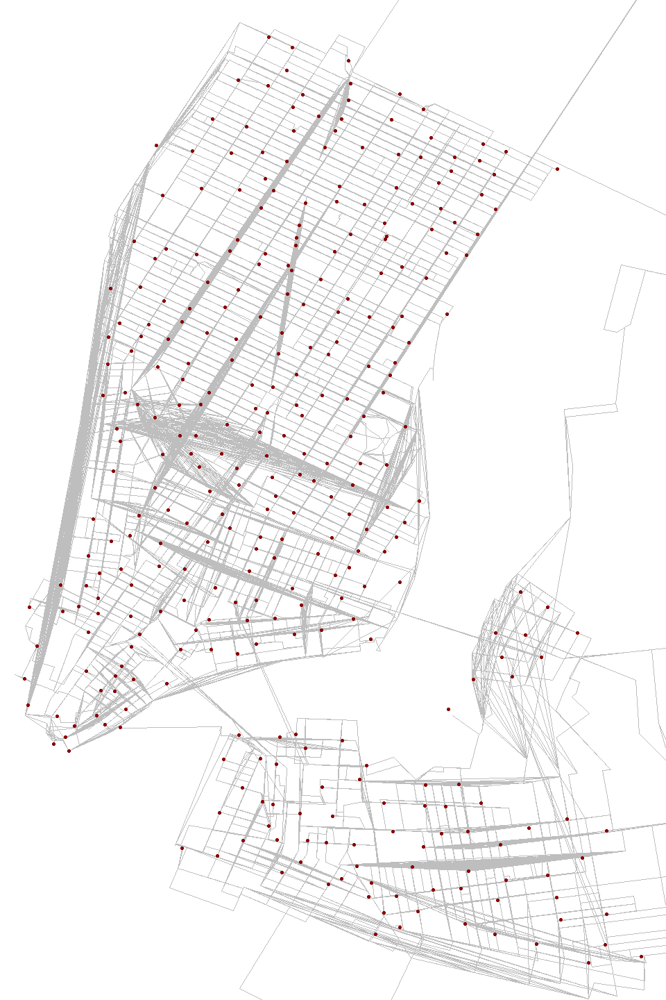
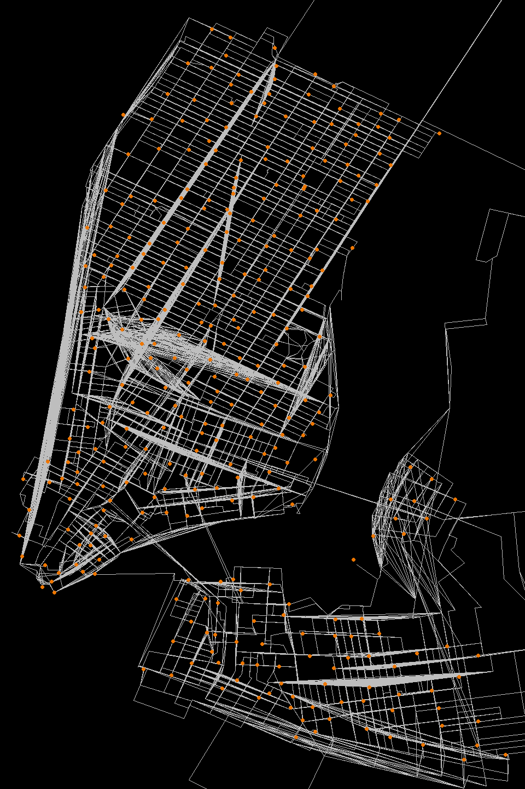
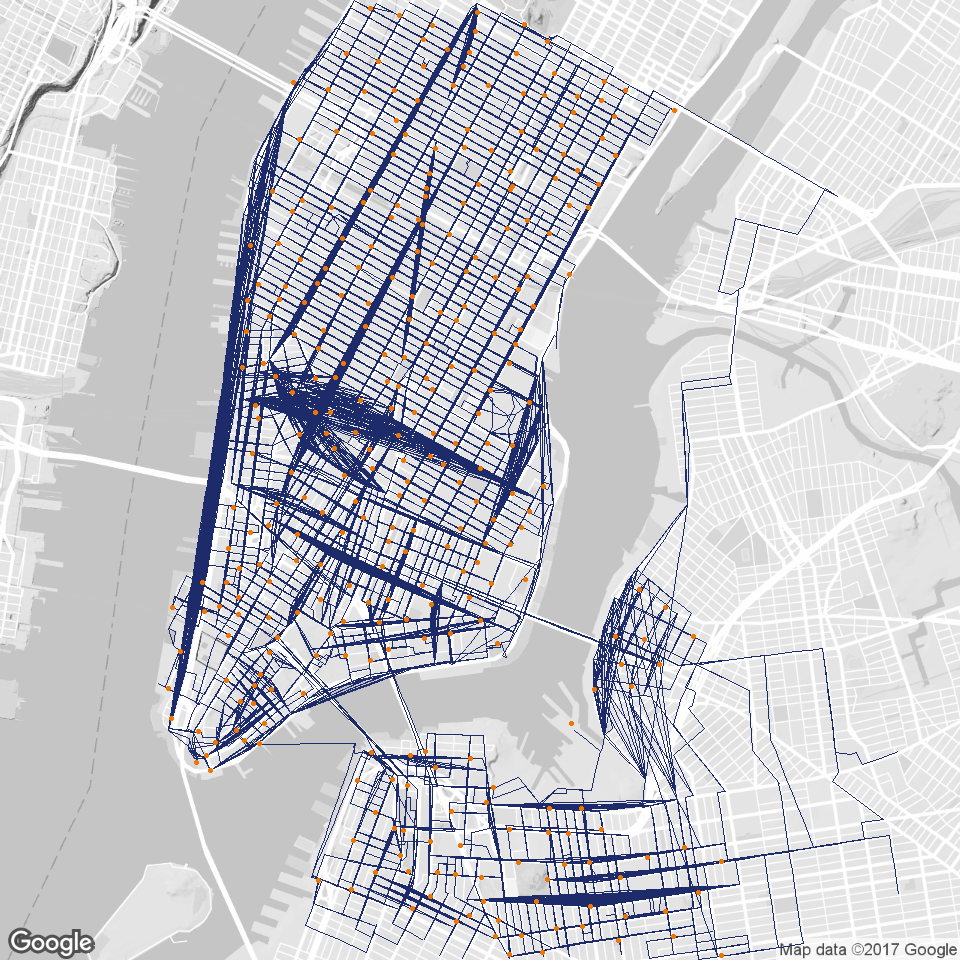

# Mapping CityBike Routes
Oleksiy Anokhin  
July 18, 2017  


## Setup


We will use the following packages:


```r
library( dplyr )
library( ggplot2 )
library( ggmap )
library( leaflet ) 
library( tigris )
library( sp )
```


# Steps to Visualize Biking Data Routes

The following steps are explained in this document.

1. Create a list of unique stations.  
2. Create a list of unique pairs of stations. 
3. Create route for each pair of stations. 
4. Create a map of NYC. 
5. Add all routes to the map. 


For this exercise we will use City Bike NYC data from January of 2015. It was obtained from the file posted on AWS, and saved as an RData file.


# Load Data


```r
# Data for Bike Trips for January, 2015

dat <- readRDS(gzcon(url("https://github.com/lecy/CityBikeNYC/raw/master/DATA/bikes.rds")))

dim( dat )
```

```
## [1] 285552     16
```

```r
head( dat )
```

<div data-pagedtable="false">
  <script data-pagedtable-source type="application/json">
{"columns":[{"label":["tripduration"],"name":[1],"type":["int"],"align":["right"]},{"label":["starttime"],"name":[2],"type":["fctr"],"align":["left"]},{"label":["stoptime"],"name":[3],"type":["fctr"],"align":["left"]},{"label":["start.station.id"],"name":[4],"type":["int"],"align":["right"]},{"label":["start.station.name"],"name":[5],"type":["fctr"],"align":["left"]},{"label":["start.station.latitude"],"name":[6],"type":["dbl"],"align":["right"]},{"label":["start.station.longitude"],"name":[7],"type":["dbl"],"align":["right"]},{"label":["end.station.id"],"name":[8],"type":["int"],"align":["right"]},{"label":["end.station.name"],"name":[9],"type":["fctr"],"align":["left"]},{"label":["end.station.latitude"],"name":[10],"type":["dbl"],"align":["right"]},{"label":["end.station.longitude"],"name":[11],"type":["dbl"],"align":["right"]},{"label":["bikeid"],"name":[12],"type":["int"],"align":["right"]},{"label":["usertype"],"name":[13],"type":["fctr"],"align":["left"]},{"label":["birth.year"],"name":[14],"type":["int"],"align":["right"]},{"label":["gender"],"name":[15],"type":["int"],"align":["right"]},{"label":["ID"],"name":[16],"type":["chr"],"align":["left"]}],"data":[{"1":"1346","2":"1/1/2015 0:01","3":"1/1/2015 0:24","4":"455","5":"1 Ave & E 44 St","6":"40.75002","7":"-73.96905","8":"265","9":"Stanton St & Chrystie St","10":"40.72229","11":"-73.99148","12":"18660","13":"Subscriber","14":"1960","15":"2","16":"455-265"},{"1":"363","2":"1/1/2015 0:02","3":"1/1/2015 0:08","4":"434","5":"9 Ave & W 18 St","6":"40.74317","7":"-74.00366","8":"482","9":"W 15 St & 7 Ave","10":"40.73936","11":"-73.99932","12":"16085","13":"Subscriber","14":"1963","15":"1","16":"434-482"},{"1":"346","2":"1/1/2015 0:04","3":"1/1/2015 0:10","4":"491","5":"E 24 St & Park Ave S","6":"40.74096","7":"-73.98602","8":"505","9":"6 Ave & W 33 St","10":"40.74901","11":"-73.98848","12":"20845","13":"Subscriber","14":"1974","15":"1","16":"491-505"},{"1":"182","2":"1/1/2015 0:04","3":"1/1/2015 0:07","4":"384","5":"Fulton St & Waverly Ave","6":"40.68318","7":"-73.96596","8":"399","9":"Lafayette Ave & St James Pl","10":"40.68852","11":"-73.96476","12":"19610","13":"Subscriber","14":"1969","15":"1","16":"384-399"},{"1":"969","2":"1/1/2015 0:05","3":"1/1/2015 0:21","4":"474","5":"5 Ave & E 29 St","6":"40.74517","7":"-73.98683","8":"432","9":"E 7 St & Avenue A","10":"40.72622","11":"-73.98380","12":"20197","13":"Subscriber","14":"1977","15":"1","16":"474-432"},{"1":"496","2":"1/1/2015 0:07","3":"1/1/2015 0:15","4":"512","5":"W 29 St & 9 Ave","6":"40.75007","7":"-73.99839","8":"383","9":"Greenwich Ave & Charles St","10":"40.73524","11":"-74.00027","12":"20788","13":"Subscriber","14":"1969","15":"2","16":"512-383"}],"options":{"columns":{"min":{},"max":[10]},"rows":{"min":[10],"max":[10]},"pages":{}}}
  </script>
</div>

```r
# Basic Bike Station Info

stations <- readRDS(gzcon(url("https://github.com/lecy/CityBikeNYC/raw/master/DATA/STATIONS.rds")))

dim( stations )
```

```
## [1] 330   4
```

```r
head( stations )
```

<div data-pagedtable="false">
  <script data-pagedtable-source type="application/json">
{"columns":[{"label":["ID"],"name":[1],"type":["int"],"align":["right"]},{"label":["StationName"],"name":[2],"type":["fctr"],"align":["left"]},{"label":["LAT"],"name":[3],"type":["dbl"],"align":["right"]},{"label":["LON"],"name":[4],"type":["dbl"],"align":["right"]}],"data":[{"1":"72","2":"W 52 St & 11 Ave","3":"40.76727","4":"-73.99393"},{"1":"79","2":"Franklin St & W Broadway","3":"40.71912","4":"-74.00667"},{"1":"82","2":"St James Pl & Pearl St","3":"40.71117","4":"-74.00017"},{"1":"83","2":"Atlantic Ave & Fort Greene Pl","3":"40.68383","4":"-73.97632"},{"1":"116","2":"W 17 St & 8 Ave","3":"40.74178","4":"-74.00150"},{"1":"119","2":"Park Ave & St Edwards St","3":"40.69609","4":"-73.97803"}],"options":{"columns":{"min":{},"max":[10]},"rows":{"min":[10],"max":[10]},"pages":{}}}
  </script>
</div>

```r
# Data on All Possible Routes (see below)

routes.list <- readRDS(gzcon(url("https://github.com/lecy/CityBikeNYC/raw/master/DATA/ALL_ROUTES_LIST.rds")))

routes.list[1]
```

```
## $S.72_to_S.72
##    m km miles seconds minutes hours leg       lon      lat
## 1  0  0     0       0       0     0   1 -73.99576 40.76799
## 2 NA NA    NA      NA      NA    NA  NA -73.99576 40.76799
```

```r
routes.df <- readRDS(gzcon(url("https://github.com/lecy/CityBikeNYC/raw/master/DATA/ALL_ROUTES_DF.rds")))

head( routes.df )
```

<div data-pagedtable="false">
  <script data-pagedtable-source type="application/json">
{"columns":[{"label":["m"],"name":[1],"type":["dbl"],"align":["right"]},{"label":["km"],"name":[2],"type":["dbl"],"align":["right"]},{"label":["miles"],"name":[3],"type":["dbl"],"align":["right"]},{"label":["seconds"],"name":[4],"type":["dbl"],"align":["right"]},{"label":["minutes"],"name":[5],"type":["dbl"],"align":["right"]},{"label":["hours"],"name":[6],"type":["dbl"],"align":["right"]},{"label":["leg"],"name":[7],"type":["int"],"align":["right"]},{"label":["lon"],"name":[8],"type":["dbl"],"align":["right"]},{"label":["lat"],"name":[9],"type":["dbl"],"align":["right"]},{"label":["route"],"name":[10],"type":["fctr"],"align":["left"]}],"data":[{"1":"0","2":"0.000","3":"0.0000000","4":"0","5":"0.0000000","6":"0.000000000","7":"1","8":"-73.99576","9":"40.76799","10":"S.72_to_S.72"},{"1":"NA","2":"NA","3":"NA","4":"NA","5":"NA","6":"NA","7":"NA","8":"-73.99576","9":"40.76799","10":"S.72_to_S.72"},{"1":"149","2":"0.149","3":"0.0925886","4":"26","5":"0.4333333","6":"0.007222222","7":"1","8":"-73.99576","9":"40.76799","10":"S.72_to_S.79"},{"1":"36","2":"0.036","3":"0.0223704","4":"60","5":"1.0000000","6":"0.016666667","7":"2","8":"-73.99492","9":"40.76917","10":"S.72_to_S.79"},{"1":"1144","2":"1.144","3":"0.7108816","4":"206","5":"3.4333333","6":"0.057222222","7":"3","8":"-73.99529","9":"40.76932","10":"S.72_to_S.79"},{"1":"1501","2":"1.501","3":"0.9327214","4":"257","5":"4.2833333","6":"0.071388889","7":"4","8":"-74.00256","9":"40.76073","10":"S.72_to_S.79"}],"options":{"columns":{"min":{},"max":[10]},"rows":{"min":[10],"max":[10]},"pages":{}}}
  </script>
</div>


# Step 1: Load a Map of NYC


Let's start with a simple step, visualizing the city. We can do this in multiple ways.


## Shapefiles

The `tigris` package provides nice functions for downloading Census Tiger shapefiles. The limitation of this approach is that it lacks a nice set of orientating features like streets and parks.


```r
# library(tigris)
# library(sp)

ny <- counties( state="NY" )

# New York County: 36061
# Queens: 36081
# Bronx: 36005
# Brooklyn: 36047
# Staten Island: 36085

manhattan.water <- area_water( state="NY", county="061" )
queens.water <- area_water( state="NY", county="081" )
bronx.water <- area_water( state="NY", county="005" )
brooklyn.water <- area_water( state="NY", county="047" )
# staten.water <- area_water( state="NY", county="085" )


nyc <- ny[ ny$GEOID %in% c(36061,36081,36005,36047) , ]


par( mar=c(0,0,0,0), bg="lightblue" )
plot( nyc, border=NA, col="gray95" )
plot( manhattan.water, col="lightblue", border=NA, add=T )
plot( queens.water, col="lightblue", border=NA, add=T )
plot( bronx.water, col="lightblue", border=NA, add=T )
plot( brooklyn.water, col="lightblue", border=NA, add=T )
# plot( staten.water, col="lightblue", border=NA, add=T )

text( as.numeric(nyc$INTPTLON), as.numeric(nyc$INTPTLAT), nyc$NAME, cex=1 )
```

<!-- -->

```r
# stations.url <- "https://github.com/lecy/CityBikeNYC/raw/master/DATA/STATIONS.rds"
# stations <- readRDS(gzcon(url( stations.url )))
# points( stations$LON, stations$LAT, col="darkred", pch=19, cex=0.3 )
```

The advantage is that Census shapefiles are drawn as polygons, which keeps the maps simple and clean.


```r
nyc <- ny[ ny$GEOID %in% c(36061,36081,36005,36047) , ]

par( mar=c(0,0,0,0), bg="gray" )
plot( nyc, border=NA, col="white", xlim=c(-74.027,-73.94377), ylim=c(40.67611,40.77737 ) )
plot( manhattan.water, col="gray", border=NA, add=T )
plot( queens.water, col="gray", border=NA, add=T )
plot( bronx.water, col="gray", border=NA, add=T )
plot( brooklyn.water, col="gray", border=NA, add=T )
```

<!-- -->

```r
# points( stations$LON, stations$LAT, col="firebrick2", pch=19, cex=0.5 )
```


## ggmap Package

Alternatively, the **`ggmap`** package connects with geographic databases like Google Maps to grab map tiles, which are PNG files the provide a backdrop to the plotting window.

The advantage is that these tiles provide a lot of rich contextual detail and are simple to use. 


```r
# library( ggmap )

qmap( "New York City, NY",  zoom=11 ) 
```

<!-- -->


We can fine-tune the maps using options in the `get_map()` function:


```r
nyc_map <- get_map( location = c(lon = -74.00, lat = 40.71), 
                    maptype = "terrain", col="bw", zoom = 13 )

ggmap( nyc_map, extent="device" )
```

<!-- -->

We can include even more options using the `get_googlemap()` function, including turning off text that clutters the map.


```r
map <- get_googlemap( center = 'east village, ny', zoom = 13, col="bw",
       style = 'style=feature:all|element:labels|visibility:off' )

ggmap( map, extent="device" )
```

<!-- -->


## Leaflet Package

Leaflet allows us to create dynamic web maps that allow the user to zoom and search the map.


```r
# library( leaflet )

leaflet( ) %>% addTiles() %>% setView(-74.0059, 40.7128, zoom = 13)
```

<!--html_preserve--><div id="htmlwidget-7a013bc838ecac17c8dc" style="width:768px;height:480px;" class="leaflet html-widget"></div>
<script type="application/json" data-for="htmlwidget-7a013bc838ecac17c8dc">{"x":{"options":{"crs":{"crsClass":"L.CRS.EPSG3857","code":null,"proj4def":null,"projectedBounds":null,"options":{}}},"calls":[{"method":"addTiles","args":["//{s}.tile.openstreetmap.org/{z}/{x}/{y}.png",null,null,{"minZoom":0,"maxZoom":18,"maxNativeZoom":null,"tileSize":256,"subdomains":"abc","errorTileUrl":"","tms":false,"continuousWorld":false,"noWrap":false,"zoomOffset":0,"zoomReverse":false,"opacity":1,"zIndex":null,"unloadInvisibleTiles":null,"updateWhenIdle":null,"detectRetina":false,"reuseTiles":false,"attribution":"&copy; <a href=\"http://openstreetmap.org\">OpenStreetMap<\/a> contributors, <a href=\"http://creativecommons.org/licenses/by-sa/2.0/\">CC-BY-SA<\/a>"}]}],"setView":[[40.7128,-74.0059],13,[]]},"evals":[],"jsHooks":[]}</script><!--/html_preserve-->


We can also fine-tune the aesthetics in Leaflet using myriad free map styles:


```r
# Leaflet 2
leaflet() %>%
  addTiles() %>%
  setView(-74.00, 40.71, zoom = 12) %>%
  addProviderTiles("CartoDB.Positron")
```

<!--html_preserve--><div id="htmlwidget-b4ea336fc63e76c433b5" style="width:768px;height:480px;" class="leaflet html-widget"></div>
<script type="application/json" data-for="htmlwidget-b4ea336fc63e76c433b5">{"x":{"options":{"crs":{"crsClass":"L.CRS.EPSG3857","code":null,"proj4def":null,"projectedBounds":null,"options":{}}},"calls":[{"method":"addTiles","args":["//{s}.tile.openstreetmap.org/{z}/{x}/{y}.png",null,null,{"minZoom":0,"maxZoom":18,"maxNativeZoom":null,"tileSize":256,"subdomains":"abc","errorTileUrl":"","tms":false,"continuousWorld":false,"noWrap":false,"zoomOffset":0,"zoomReverse":false,"opacity":1,"zIndex":null,"unloadInvisibleTiles":null,"updateWhenIdle":null,"detectRetina":false,"reuseTiles":false,"attribution":"&copy; <a href=\"http://openstreetmap.org\">OpenStreetMap<\/a> contributors, <a href=\"http://creativecommons.org/licenses/by-sa/2.0/\">CC-BY-SA<\/a>"}]},{"method":"addProviderTiles","args":["CartoDB.Positron",null,null,{"errorTileUrl":"","noWrap":false,"zIndex":null,"unloadInvisibleTiles":null,"updateWhenIdle":null,"detectRetina":false,"reuseTiles":false}]}],"setView":[[40.71,-74],12,[]]},"evals":[],"jsHooks":[]}</script><!--/html_preserve-->


# Step 2: Create a Database of Unique Stations

Starting with the Bike Routes data provided by CityBike on AWS, we can create a database of all of the stations operating in the city at the time.


```r
names( dat )
```

```
##  [1] "tripduration"            "starttime"              
##  [3] "stoptime"                "start.station.id"       
##  [5] "start.station.name"      "start.station.latitude" 
##  [7] "start.station.longitude" "end.station.id"         
##  [9] "end.station.name"        "end.station.latitude"   
## [11] "end.station.longitude"   "bikeid"                 
## [13] "usertype"                "birth.year"             
## [15] "gender"                  "ID"
```

```r
# Pick start station attributes

keep.these.vars <- c( "start.station.id",
                      "start.station.name",
                     "start.station.latitude",
                     "start.station.longitude" )

stations <- unique( dat[ keep.these.vars ] )

nrow(stations) # 330 unique stations
```

```
## [1] 330
```

```r
names(stations) <- c("ID", "StationName", "LAT", "LON") # Rename column titles

stations <- stations[order(stations$ID),] # put station in ID order from 72 till 3002

rownames(stations) <- NULL

head(stations)
```

<div data-pagedtable="false">
  <script data-pagedtable-source type="application/json">
{"columns":[{"label":["ID"],"name":[1],"type":["int"],"align":["right"]},{"label":["StationName"],"name":[2],"type":["fctr"],"align":["left"]},{"label":["LAT"],"name":[3],"type":["dbl"],"align":["right"]},{"label":["LON"],"name":[4],"type":["dbl"],"align":["right"]}],"data":[{"1":"72","2":"W 52 St & 11 Ave","3":"40.76727","4":"-73.99393"},{"1":"79","2":"Franklin St & W Broadway","3":"40.71912","4":"-74.00667"},{"1":"82","2":"St James Pl & Pearl St","3":"40.71117","4":"-74.00017"},{"1":"83","2":"Atlantic Ave & Fort Greene Pl","3":"40.68383","4":"-73.97632"},{"1":"116","2":"W 17 St & 8 Ave","3":"40.74178","4":"-74.00150"},{"1":"119","2":"Park Ave & St Edwards St","3":"40.69609","4":"-73.97803"}],"options":{"columns":{"min":{},"max":[10]},"rows":{"min":[10],"max":[10]},"pages":{}}}
  </script>
</div>


```r
# dplyr approach

# Select four columns from "dat" dataframe and identify unique

stations <- dat %>% 
  select( start.station.id, 
          start.station.name,
          start.station.latitude,
          start.station.longitude  ) %>% 
  distinct                      
```


We should have 330 unique stations in the city:


```r
nyc <- ny[ ny$GEOID %in% c(36061,36081,36005,36047) , ]

par( mar=c(0,0,0,0), bg="gray" )
plot( nyc, border=NA, col="white", xlim=c(-74.027,-73.94377), ylim=c(40.67611,40.77737 ) )
plot( manhattan.water, col="gray", border=NA, add=T )
plot( queens.water, col="gray", border=NA, add=T )
plot( bronx.water, col="gray", border=NA, add=T )
plot( brooklyn.water, col="gray", border=NA, add=T )
# points( stations$LON, stations$LAT, col="firebrick2", pch=19, cex=0.5 )


points( stations$LON, stations$LAT, col="darkred", pch=19, cex=0.7 )

text( stations$LON, stations$LAT, stations$ID, pos=3, cex=0.6, offset=0.3, col="gray40" )
```

<!-- -->


```r
# library( ggmap )

map <- get_googlemap( center = 'east village, ny', zoom = 13, col="bw",
       style = 'style=feature:all|element:labels|visibility:off' )

myplot <- ggmap( map, extent="device" )

myplot + geom_point( aes(x = LON, y = LAT ), colour="darkred", size=1, data = stations )
```

<!-- -->


# Step 3: Identify Station Pairs

We will visualize a bike route using the `route()` function in **ggmap**, which builds a set of directions by querying a start and end point through the Google Maps API. Each route will look something like this:


```r
# get the route from Google

rt <- route( from=c(-73.96905,40.75002), 
             to=c(-73.99148,40.72229), 
             mode="bicycling",
             structure="route" )

rt
```

<div data-pagedtable="false">
  <script data-pagedtable-source type="application/json">
{"columns":[{"label":["m"],"name":[1],"type":["dbl"],"align":["right"]},{"label":["km"],"name":[2],"type":["dbl"],"align":["right"]},{"label":["miles"],"name":[3],"type":["dbl"],"align":["right"]},{"label":["seconds"],"name":[4],"type":["dbl"],"align":["right"]},{"label":["minutes"],"name":[5],"type":["dbl"],"align":["right"]},{"label":["hours"],"name":[6],"type":["dbl"],"align":["right"]},{"label":["leg"],"name":[7],"type":["int"],"align":["right"]},{"label":["lon"],"name":[8],"type":["dbl"],"align":["right"]},{"label":["lat"],"name":[9],"type":["dbl"],"align":["right"]}],"data":[{"1":"97","2":"0.097","3":"0.0602758","4":"12","5":"0.2000000","6":"0.003333333","7":"1","8":"-73.96898","9":"40.74999"},{"1":"228","2":"0.228","3":"0.1416792","4":"83","5":"1.3833333","6":"0.023055556","7":"2","8":"-73.96842","9":"40.75075"},{"1":"3510","2":"3.510","3":"2.1811140","4":"703","5":"11.7166667","6":"0.195277778","7":"3","8":"-73.97079","9":"40.75174"},{"1":"42","2":"0.042","3":"0.0260988","4":"7","5":"0.1166667","6":"0.001944444","7":"4","8":"-73.99096","9":"40.72412"},{"1":"158","2":"0.158","3":"0.0981812","4":"70","5":"1.1666667","6":"0.019444444","7":"5","8":"-73.99103","9":"40.72375"},{"1":"462","2":"0.462","3":"0.2870868","4":"168","5":"2.8000000","6":"0.046666667","7":"6","8":"-73.99165","9":"40.72241"},{"1":"NA","2":"NA","3":"NA","4":"NA","5":"NA","6":"NA","7":"NA","8":"-73.98655","9":"40.72088"}],"options":{"columns":{"min":{},"max":[10]},"rows":{"min":[10],"max":[10]},"pages":{}}}
  </script>
</div>

```r
# plot the route in ggmap

nyc <- qmap( "New York City, NY", color='bw', zoom=13 )  

nyc +  geom_path(  aes( x = rt$lon , y = rt$lat ), 
            colour="red", data=rt, alpha=1, size=2 )
```

<!-- -->


There are only 330 stations, which might make this sounds like a simple problem. Unfortunately, there are quite a few unique combinations of these stations. Specifically, there are 330 *x* 329 = 108,570 unique routes possible.   

We will build the routes database using iterated calls to the Google Maps API using a loop structure that looks something like this:


```r
for( i in c("A","B","C") )
{
  
  for( j in c("A","B","C") )
  {
    
    print( paste( "Route ID: ", i, "-", j, sep="" ) )
    
  }
  
}
```

```
## [1] "Route ID: A-A"
## [1] "Route ID: A-B"
## [1] "Route ID: A-C"
## [1] "Route ID: B-A"
## [1] "Route ID: B-B"
## [1] "Route ID: B-C"
## [1] "Route ID: C-A"
## [1] "Route ID: C-B"
## [1] "Route ID: C-C"
```


# Step 4: Build the Routes Database

See the tutoral on Buiding the Routes Database for more info on these steps. The basic script was:


```r
for(i in 1:330)
{
  print(paste("LOOP NUMBER", i))
  flush.console()
  routes <- list()
  for(j in 1:330)
  {
    rt <- try(route(from=c(stations$LON[i], stations$LAT[i]), 
                      to=c(stations$LON[j], stations$LAT[j]), 
                      mode="bicycling",
                      structure="route" 
    ))
    route.name <- paste("S.", stations$ID[i], "_to_S.", stations$ID[j], sep="")
    rt <- cbind(rt, from.to=route.name)
    routes[[j]] <- rt
    names(routes)[j] <- route.name
    print(paste("I=", i, "J=", j))
    flush.console()
  }  # end of j loop
  
  id <- substr(1000 + i, 2, 4)
  list.name <- paste("RoutesFromStation", id, ".rda", sep="")
  save(routes, file=list.name)
}
```


The script generated routes for all ~108,000 unique station pairs (since there are one-way streets in NYC we did not assume that the route from from point i to point j would be identical to the route from point j to point i). These routes have been saved as a database and are available on GitHub in the DATA folder. 

We included a version that stores each route as a separate data frame in a list. The list elements can be referenced by the route name (e.g. "S.71_to_S.398"). We also include a version that has all routes stored as a single data frame.

They can be loaded by:


```r
# Data on All Possible Routes (see below)

routes.list <- readRDS(gzcon(url("https://github.com/lecy/CityBikeNYC/raw/master/DATA/ALL_ROUTES_LIST.rds")))


routes.df <- readRDS(gzcon(url("https://github.com/lecy/CityBikeNYC/raw/master/DATA/ALL_ROUTES_DF.rds")))
```


# Step 5: Mapping Routes

The visualization of CityBike traffic requires that we layer many bike trips onto the base map. We can do this through a loop, or treating each route as a factor level and adding them all together.


## Using Core Plot Functions


### White Background


```r
# create a bounding box using station locations

max.lat <- max( stations$LAT )
max.lon <- max( stations$LON )
min.lat <- min( stations$LAT )
min.lon <- min( stations$LON )

# uses the list version of routes

par( mar=c(0,0,0,0) )

plot( NA, NA, xlim=c(min.lon,max.lon), ylim=c(min.lat,max.lat), bty="n", 
      yaxt="n", xaxt="n" )

for( i in 1:length( routes.list ) )
{

   # sub.dat <- d2[ ]

   lines( routes.list[[i]]$lon, routes.list[[i]]$lat, col="gray" )

}

points( stations$LON, stations$LAT, col="darkred", pch=19, cex=0.7 )
```

<!-- -->


### Black Background


```r
par( mar=c(0,0,0,0), bg="black" )

plot( NA, NA, xlim=c(min.lon,max.lon), ylim=c(min.lat,max.lat) )


for( i in 1:length( routes.list ) )
{

   # sub.dat <- d2[ ]

   lines( routes.list[[i]]$lon, routes.list[[i]]$lat, col="gray" )

}

points( stations$LON, stations$LAT, col="darkorange2", pch=19, cex=1 )
```

<!-- -->


## In ggmap


```r
map <- get_googlemap( center = 'east village, ny', zoom = 13, col="bw",
       style = 'style=feature:all|element:labels|visibility:off' )

myplot <- ggmap( map, extent="device" )

# uses the data frame version of routes

myplot <- myplot + 
          
  geom_path( aes(x = lon, y = lat, group = factor(route) ), 
            colour="#1E2B6A", data = routes.df ) + 
  
  geom_point( aes(x = LON, y = LAT ), 
              colour="darkorange2", size=1.5, data = stations )

myplot
```

<!-- -->


<style type="text/css">
p {
color: black;
margin: 0 0 20px 0;
}

td {
    padding: 3px 10px 3px 10px;
    text-align: center;
}

table
{ 
    margin-left: auto;
    margin-right: auto;
    margin-top:80px;
    margin-bottom:100px;
}

h1, h2{
  margin-top:100px;
  margin-bottom:20px;
}

H5{
    text-align: center;
    color: gray;
    font-size:0.8em;
}

img {
    max-width: 90%;
    display: block;
    margin-right: auto;
    margin-left: auto;
    margin-top:30px;
    margin-bottom:20px;
}

pre {
  overflow-x: auto;
}

pre code {
   display: block; 
   padding: 0.5em;
   margin-bottom:20px;
}

code {
  font-size: 92%;
  border: 10px solid #F8F8F8;
  margin-bottom: 2px;
}

code[class] {
  background-color: #F8F8F8;
}

</style>


